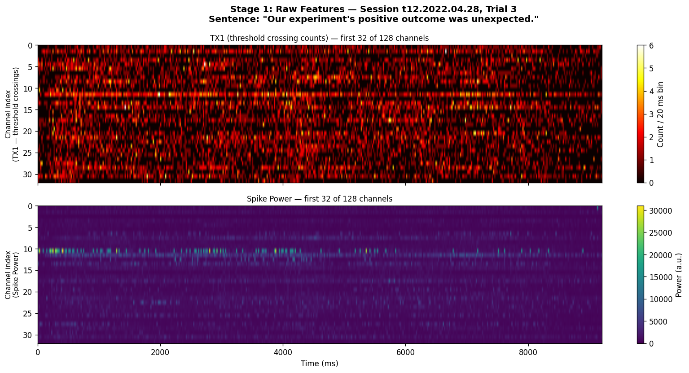
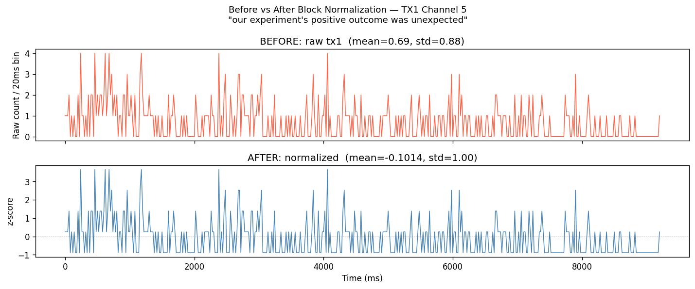
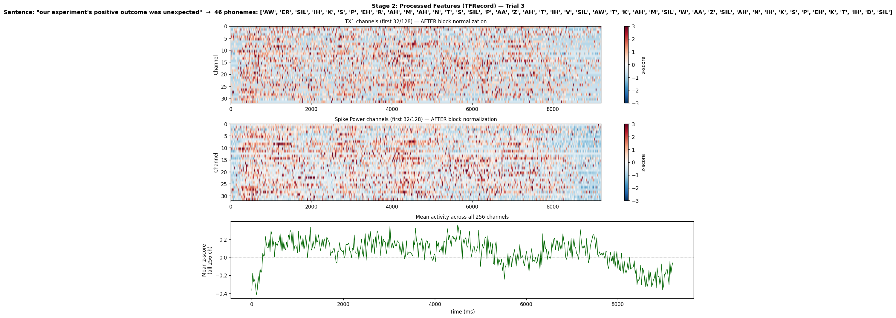
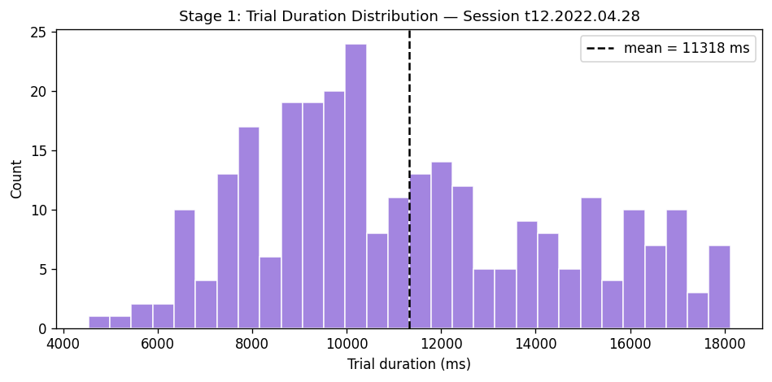
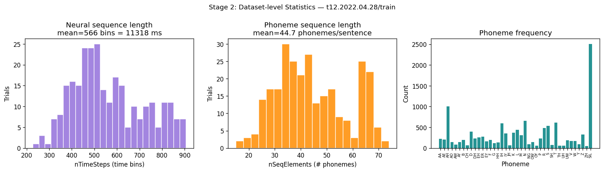
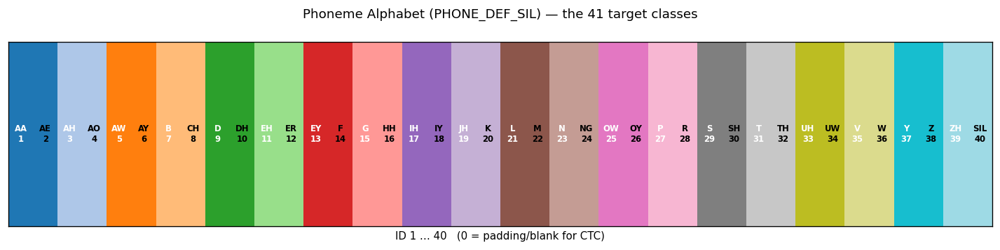

# Dataset Reference: T12 Speech BCI (Willett et al. 2023)

**Last Updated:** 2026-05-01  
**Source paper:** Willett et al., *Nature* 2023 — "A high-performance speech neuroprosthesis" (s41586-023-06377-x)

---

## 1. Overview

The dataset consists of intracortical electrophysiology recordings from a single human participant (T12) implanted with two 96-electrode Utah arrays in the hand-knob area of the left motor cortex (ventral premotor + primary motor cortex). T12 had ALS resulting in paralysis below the neck. During recording sessions, T12 attempted to silently speak (or mouthed) sentences while the neural signals were captured. Each sentence is one trial.

**The task:** decode what T12 is trying to say purely from brain signals, without any muscle movement.

### Summary statistics

| Property | Value | Source |
|---|---|---|
| Subject | T12 (single participant) | paper: s41586-023-06377-x |
| Implant | 2 × 96-electrode Utah arrays, left motor cortex | paper: s41586-023-06377-x |
| Sessions | 24 (April 28 → August 25, 2022) | computed: `ls data/derived/tfRecords/` |
| Train utterances | 8,800 | computed: count TFRecords with split=train |
| Test utterances | 880 | computed: count TFRecords with split=test |
| **Total utterances** | **9,680** | computed: 8,800 + 880 |
| **Unique sentences** | **9,561** | computed: `len(set(all_texts))` over all TFRecords |
| Sampling rate | 50 Hz (20 ms per bin) | `AnalysisExamples/eda.ipynb` Figure 5 x-axis (`time_ms = np.arange(T) * 20`) |
| Neural feature dimension | 256 per time bin | `AnalysisExamples/makeTFRecordsFromSession.py:33` — 128 tx1 + 128 spikePow |
| Avg. sentence duration | ~6.3 s (train) | computed from TFRecord `nTimeSteps × 20 ms` |
| Avg. words per sentence | 6.3 (range: 1–18) | computed from `transcription` field |
| Avg. phonemes per sentence | 28 (range: 5–77) | computed from TFRecord `nSeqElements` field |

> **Note on sentence count:** The dataset has 9,561 *unique* sentences across 9,680 total utterances (119 sentences appear in exactly two different sessions; no sentence appears three or more times). Each session presents a distinct set of ~300–560 sentences; there is no small fixed vocabulary being recycled. The paper describes T12 reading sentence prompts from a screen — different sentences each session.

---

## 2. Recording & Signal Description

### 2.1 What is recorded

At each 20 ms time bin, two types of features are extracted from the electrodes and concatenated into a 256-dimensional vector.

**Source:** `AnalysisExamples/makeTFRecordsFromSession.py` lines 29–33:
```python
# collect area 6v tx1 and spikePow features
# first 128 columns = area 6v only
features = np.concatenate([dat['tx1'][0,i][:,0:128], dat['spikePow'][0,i][:,0:128]], axis=1)
```

| Feature | Channels (in 256-d vector) | Description | Source |
|---|---|---|---|
| **TX1** (threshold crossings) | 0–127 | Integer counts of how many times the electrode voltage crossed a threshold (∝ spike rate). Values typically 0–8 per bin. | `makeTFRecordsFromSession.py:33`, `eda.ipynb` Figure 1 |
| **Spike Power** | 128–255 | Root-mean-square power of the broadband signal in the threshold-crossing band. Values span a wide dynamic range (130–35,000 a.u. raw). | `makeTFRecordsFromSession.py:33`, `eda.ipynb` Figure 1 |

**Why 128 channels, not 192?** The hardware implants 2×96=192 electrodes, but `[:,0:128]` selects only the first 128 columns (labelled "area 6v" — ventral premotor cortex) in the raw `.mat` files. The remaining channels are discarded at TFRecord creation time.

```
raw .mat:   tx1[trial][:, :128]  +  spikePow[trial][:, :128]
              ↓ concatenate                         (makeTFRecordsFromSession.py:33)
inputFeatures: (T, 256)   ← what ends up in TFRecords
```

### 2.2 Raw neural signals (before normalization)



*TX1 counts are integer-valued and sparse (most bins = 0). Spike power spans several orders of magnitude across channels and trials, making per-channel normalization critical.*

---

## 3. Data Files and Formats

### 3.1 Raw competition data — `.mat` files

Location: `data/competitionData/{split}/{session}.mat`

Each `.mat` file contains one full recording session (all trials for that day).
**Source:** `AnalysisExamples/makeTFRecordsFromSession.py:20-33` (shows how each field is accessed).

| Field | Shape | Description |
|---|---|---|
| `sentenceText` | (N_trials,) | Transcription text for each trial |
| `tx1` | (1, N_trials) object | Per-trial tx1 array, each element shape (T, ≥128) |
| `spikePow` | (1, N_trials) object | Per-trial spike power, each element shape (T, ≥128) |
| `blockIdx` | (N_trials, 1) | Which recording block (sub-session) each trial belongs to |
| `tx2,tx3,tx4` | (1, N_trials) object | Higher-order crossing features (not used) |

**Note:** The raw `.mat` files are not included in this repository — only the derived TFRecords are. The shapes above are inferred from `makeTFRecordsFromSession.py` and the eda.ipynb notebook.

### 3.2 Processed data — TFRecord files

Location: `data/derived/tfRecords/{session}/{split}/chunk_0.tfrecord`

Each TFRecord entry represents **one trial (sentence)**. Fields:
**Source:** `AnalysisExamples/makeTFRecordsFromSession.py:130-138` (the `feature` dict passed to `TFRecordWriter`).

| Field | Shape | Type | Description | Code source |
|---|---|---|---|---|
| `inputFeatures` | (T, 256) | float32 | Block-normalized z-scored neural features (TX1 + SpikePow concatenated) | `makeTFRecordsFromSession.py:131` |
| `nTimeSteps` | scalar | int64 | Number of valid time bins T for this trial | `makeTFRecordsFromSession.py:135` |
| `transcription` | (500,) | int64 | ASCII codes of the sentence text, zero-padded | `makeTFRecordsFromSession.py:128-138`, `maxSeqLen=500` at line 73 |
| `nSeqElements` | scalar | int64 | Number of phonemes in the sentence | `makeTFRecordsFromSession.py:136` |
| `seqClassIDs` | (nSeqElements,) | int64 | Phoneme ID sequence (1-indexed; 0 = padding) | `makeTFRecordsFromSession.py:121`, uses `PHONE_DEF_SIL` |
| `classLabelsOneHot` | (T, 31) | float32 | Per-timestep one-hot phoneme label (for CE loss in two-stage model) | `makeTFRecordsFromSession.py:72,96` — `nClasses=31` |
| `ceMask` | (T,) | float32 | Binary: 1 during speech, 0 during silence/padding | `makeTFRecordsFromSession.py:125-126` |
| `newClassSignal` | (T,) | float32 | 1 at phoneme boundaries (for alignment-based CE loss) | `makeTFRecordsFromSession.py:97` |

> **For the E2E model**, only `inputFeatures`, `nTimeSteps`, and `transcription` are used. The phoneme fields (`seqClassIDs`, `classLabelsOneHot`, `newClassSignal`) exist for the two-stage phoneme decoder baseline and are ignored in E2E training.
> **Source:** `AnalysisExamples/e2e/dataset.py` — only these three fields are read in `BCIDataset`.

### 3.3 Normalization applied in TFRecords

`inputFeatures` already has **block-level z-score normalization** applied — each block's mean and std are subtracted per channel.
**Source:** `AnalysisExamples/makeTFRecordsFromSession.py:42-56`:

```python
# block-wise feature normalization
blockNums = np.squeeze(dat['blockIdx'])
blockList = np.unique(blockNums)
# ...
for b in range(len(blocks)):
    feats = np.concatenate(input_features[blocks[b][0]:(blocks[b][-1]+1)], axis=0)
    feats_mean = np.mean(feats, axis=0, keepdims=True)
    feats_std  = np.std(feats,  axis=0, keepdims=True)
    for i in blocks[b]:
        input_features[i] = (input_features[i] - feats_mean) / (feats_std + 1e-8)
```

After this normalization, `inputFeatures` has approximately mean ≈ 0, std ≈ 1 per channel.



*Left: raw TX1 values on one channel. Right: the same channel after block normalization — centred and scaled.*

#### Why block-level and not session-level?

Two reasons, both visible in the data:

**1. The spike detection threshold is set once per block, not per session.**
TX1 counts how many times the electrode voltage crosses a fixed threshold. Before each recording block, the experimenter sets this threshold based on the current signal quality. If the threshold changes between block 3 and block 7 within the same session, the TX1 baseline shifts discontinuously. A session-level mean would be a blend of all these step-changes and would not correctly centre any individual block. Block normalization removes each block's own baseline before it reaches the model.

**2. Each block corresponds to a distinct experimental condition.**
From `AnalysisExamples/getSpeechSessionBlocks.py`, blocks within a session are labelled by paradigm: Open Loop (OL), Closed Loop stage 1, Closed Loop stage 2, Closed Loop repeat, etc. In closed-loop blocks, T12 receives real-time neural feedback, which changes his motor strategy and shifts the neural signal distribution. Pooling all blocks into one session-level z-score would blur these regimes together.

**Why not per-trial?** Per-trial normalization would destroy amplitude differences between trials — a sentence spoken with stronger motor intent has genuinely higher spike power than a softer one. That between-trial amplitude variation is real neural signal, so it must be preserved.

**Block is the right granularity because:** it is the natural stationarity unit (one threshold setting, one experimental paradigm, ~20–40 trials → reliable statistics). Finer removes useful signal; coarser fails to remove intra-session non-stationarity.

#### The two normalizations are complementary in scale

The E2E dataset pipeline (`AnalysisExamples/e2e/dataset.py`) applies an **additional per-session z-score** on top of the block normalization, computing stats from all training examples in each session.
**Source:** `AnalysisExamples/e2e/dataset.py` — `BCIDataset.__getitem__`:

```python
ecog_normalized = (ecog - session_mean) / session_std    # applied at __getitem__
```

| Normalization | Granularity | What it removes |
|---|---|---|
| Block z-score (TFRecord creation) | Per block, per channel | Within-session drift: threshold re-sets, paradigm changes between blocks |
| Session z-score (E2E dataset.py) | Per session, per channel | Cross-day drift: electrode impedance changes, slow signal amplitude trends over weeks |



*After both normalizations: TX1 (top), Spike Power (middle), mean activity across all 256 channels (bottom). Note the clear temporal structure during the speech attempt.*

---

## 4. Per-Session Breakdown

**Source:** Computed by listing `data/derived/tfRecords/` and counting TFRecord entries per session/split.
**Split rule:** `README.md` line 18 — "test contains the last block of each day (40 sentences), competitionHoldOut contains the first two (80 sentences), and train contains the rest."

| Session | Train | Test | Train duration (min) |
|---|---|---|---|
| t12.2022.04.28 | 280 | 20 | 52.8 |
| t12.2022.05.05 | 360 | 20 | 60.9 |
| t12.2022.05.17 | 420 | 20 | 51.1 |
| t12.2022.05.19 | 180 | 20 | 21.3 |
| t12.2022.05.24 | 360 | 40 | 38.7 |
| t12.2022.05.26 | 360 | 40 | 41.4 |
| t12.2022.06.02 | 400 | 40 | 39.3 |
| t12.2022.06.07 | 360 | 40 | 35.0 |
| t12.2022.06.14 | 320 | 40 | 34.4 |
| t12.2022.06.16 | 320 | 40 | 33.3 |
| t12.2022.06.21 | 320 | 40 | 29.4 |
| t12.2022.06.23 | 480 | 40 | 43.4 |
| t12.2022.06.28 | 360 | 40 | 34.6 |
| t12.2022.07.05 | 360 | 40 | 34.3 |
| t12.2022.07.14 | 400 | 40 | 39.2 |
| t12.2022.07.21 | 400 | 40 | 38.6 |
| t12.2022.07.27 | 400 | 40 | 38.6 |
| t12.2022.07.29 | 200 | 40 | 19.5 |
| t12.2022.08.02 | 400 | 40 | 40.4 |
| t12.2022.08.11 | 320 | 40 | 31.8 |
| t12.2022.08.13 | 320 | 40 | 30.7 |
| t12.2022.08.18 | 440 | 40 | 43.1 |
| t12.2022.08.23 | 520 | 40 | 43.1 |
| t12.2022.08.25 | 520 | 40 | 48.2 |
| **Total** | **8,800** | **880** | **922.9** |

**Notes:**
- The first two sessions (Apr 28, May 05) have 20 test trials vs 40 for all later sessions — per `README.md`: "test contains the last block of each day (40 sentences)" but early sessions had smaller blocks.
- Session May 19 and Jul 29 have unusually short training sets (180 and 200 trials), roughly half the usual 360–520.

---

## 5. Sentence Statistics



*Distribution of trial (sentence) durations across all training sessions. Mean ~6.3 s, with a long tail up to ~18 s for longer sentences.*



*Left: neural sequence length distribution. Middle: phoneme count per sentence. Right: phoneme frequency across all training trials.*

**Source for all statistics below:** Computed from TFRecord fields (`nTimeSteps × 20 ms` for duration, `transcription` for word count, `nSeqElements` for phoneme count).

| Statistic | Value |
|---|---|
| Mean sentence duration | 6,293 ms (train), 6,011 ms (test) |
| Std of duration | 2,240 ms |
| Min / Max duration | 1,940 ms / 18,120 ms |
| Mean words per sentence | 6.3 |
| Std words per sentence | 2.3 |
| Min / Max words | 1 / 18 |
| Mean phonemes per sentence | 28.1 |
| Std phonemes per sentence | 10.2 |
| Min / Max phonemes | 5 / 77 |

---

## 6. Phoneme Labels

The dataset includes phoneme-level labels aligned to the neural signal. These are used by the two-stage baseline (phoneme decoder → WFST) but **not** needed for E2E training.

`seqClassIDs` uses the `PHONE_DEF_SIL` alphabet.
**Source:** `AnalysisExamples/makeTFRecordsFromSession.py:9` — imports `PHONE_DEF_SIL` from `neuralDecoder.datasets.speechDataset`; line 86 `phoneToId(p) = PHONE_DEF_SIL.index(p)`.



*All 41 phoneme classes. ID 0 = padding/blank. IDs 1–41 correspond to entries in `PHONE_DEF_SIL`.*

`classLabelsOneHot` in the TFRecord uses a **31-class** subset.
**Source:** `AnalysisExamples/makeTFRecordsFromSession.py:72` — `nClasses = 31`.

The phoneme labels are frame-level: `classLabelsOneHot[t]` indicates what phoneme T12 was producing at time bin `t`. Boundaries between phonemes are marked in `newClassSignal`.
**Source:** `AnalysisExamples/makeTFRecordsFromSession.py:96-97`.

---

## 7. Train / Test Split

**Source:** `README.md` lines 17–20 (official split description).

The split is **fixed and pre-defined** — not random. The same test set is used across all model comparisons.

- Train: last block of each day is held out as test; all remaining blocks are train
- Test: last block of each recording day = 40 sentences (20 for the first two early sessions)
- No session-level held-out validation; all 24 sessions appear in both train and test

---

## 8. Key Constraints for Modelling

1. **Single participant.** All data comes from T12. Models trained here do not generalise to other participants without retraining. *(paper: s41586-023-06377-x)*

2. **Non-stationarity across sessions.** Neural signals drift substantially day-to-day (electrode impedance, neural signal amplitude, slight array movement). This is why per-session normalization is critical and why session identity (`session_idx`) must be tracked through the model. *(observable from variance in raw feature heatmaps across sessions in `eda.ipynb`)*

3. **Small dataset.** 8,800 training utterances totalling ~923 minutes of actual neural recording (sentences are interleaved with rest periods). This is a very small dataset for training a sequence-to-sequence model from scratch — explains why large LLMs overfit. *(computed from `nTimeSteps` in TFRecords)*

4. **Attempted speech, not produced speech.** T12 cannot produce audible speech. The neural signals reflect attempted speech intent, not acoustic speech production. There is no audio reference signal. *(paper: s41586-023-06377-x)*

5. **Near-unique sentence set.** 9,561 out of 9,680 utterances are unique sentences. Only 119 sentences appear exactly twice (once in two different sessions). There is no small fixed vocabulary. *(computed: see Section 1 note)*

---

## 9. How to Load the Data

### Read one TFRecord entry (Python)

**Source:** `AnalysisExamples/eda.ipynb` Stage 2 cell — adapted to show all fields.

```python
import tensorflow as tf
import numpy as np

feature_desc = {
    'inputFeatures':    tf.io.VarLenFeature(tf.float32),
    'nTimeSteps':       tf.io.VarLenFeature(tf.int64),
    'transcription':    tf.io.VarLenFeature(tf.int64),
    'nSeqElements':     tf.io.VarLenFeature(tf.int64),
    'seqClassIDs':      tf.io.VarLenFeature(tf.int64),
    'classLabelsOneHot':tf.io.VarLenFeature(tf.float32),
    'ceMask':           tf.io.VarLenFeature(tf.float32),
    'newClassSignal':   tf.io.VarLenFeature(tf.float32),
}

tfr_path = "data/derived/tfRecords/t12.2022.04.28/train/chunk_0.tfrecord"
for raw_record in tf.data.TFRecordDataset(tfr_path).take(1):
    parsed = tf.io.parse_single_example(raw_record, feature_desc)
    nT     = int(tf.sparse.to_dense(parsed['nTimeSteps']).numpy()[0])
    feats  = tf.sparse.to_dense(parsed['inputFeatures']).numpy().reshape(nT, 256)
    text   = ''.join([chr(c) for c in tf.sparse.to_dense(parsed['transcription']).numpy() if c > 0])
    print(f"'{text}'  →  ECoG shape: {feats.shape}")
```

### Load via the E2E dataset class (PyTorch)

**Source:** `AnalysisExamples/e2e/dataset.py` — `BCIDataset` and `bci_collate_fn`.

```python
from AnalysisExamples.e2e.dataset import BCIDataset, bci_collate_fn
from torch.utils.data import DataLoader
from transformers import AutoTokenizer

tokenizer = AutoTokenizer.from_pretrained("Qwen/Qwen3.5-0.8B-Base", trust_remote_code=True)
sessions = ["t12.2022.04.28", "t12.2022.05.05"]   # subset for testing

ds = BCIDataset(
    data_dir="data/derived/tfRecords",
    sessions=sessions,
    split="train",
    tokenizer=tokenizer,
    max_text_len=64,
    augment=True,
)
loader = DataLoader(ds, batch_size=8, collate_fn=bci_collate_fn)

batch = next(iter(loader))
# batch["ecog"]        → (B, T_max, 256)  z-scored ECoG, padded
# batch["ecog_lengths"]→ (B,)             valid T per sample
# batch["input_ids"]   → (B, L_max)       [BOS | text | EOS] token IDs
# batch["labels"]      → (B, L_max-1)     input_ids[1:] for causal LM loss
# batch["session_idx"] → (B,)             session index [0, 23] for PerSessionNorm
# batch["texts"]       → list of str      raw transcription text
```

---

## 10. Further Reading

- **Primary paper:** Willett et al., *Nature* 2023 — full methodology, participant description, and neural analysis. File: `s41586-023-06377-x.pdf`
- **Predecessor thesis:** Seto et al. — two-stage pipeline baseline (phoneme → WFST → words). File: `laporanTugasAkhir-13521081-FINALFINAL.docx.pdf`
- **EDA notebook:** `AnalysisExamples/eda.ipynb` — interactive exploration of one session at all processing stages
- **TFRecord creation:** `AnalysisExamples/makeTFRecordsFromSession.py` — how raw `.mat` → TFRecords (with exact field names and normalization code)
- **Dataset loader:** `AnalysisExamples/e2e/dataset.py` — PyTorch `BCIDataset` for E2E training
