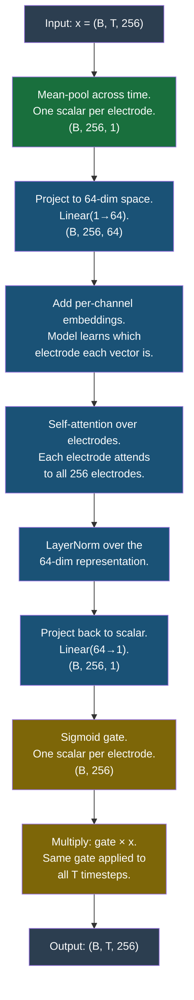
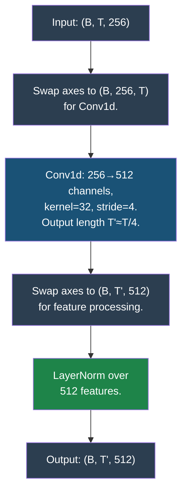
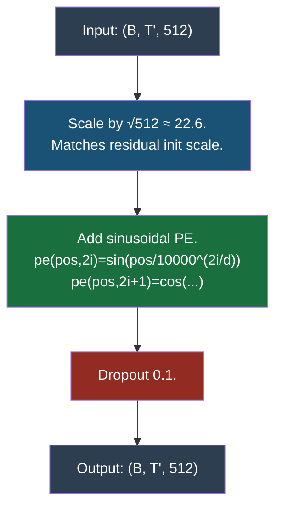
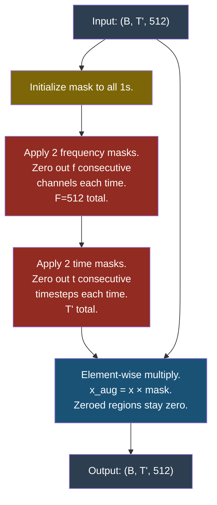
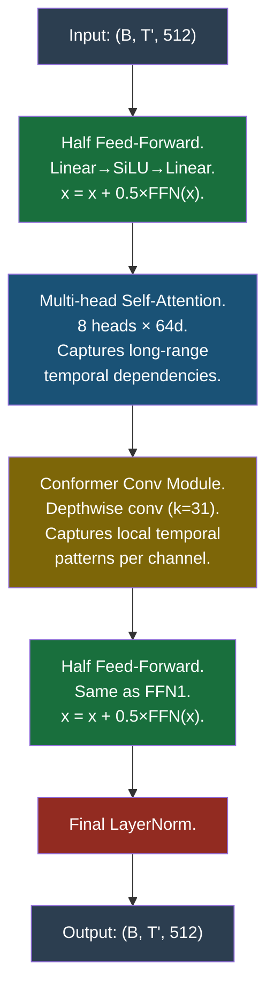
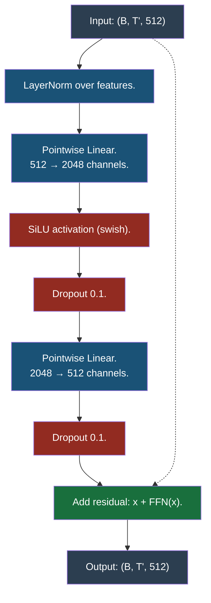
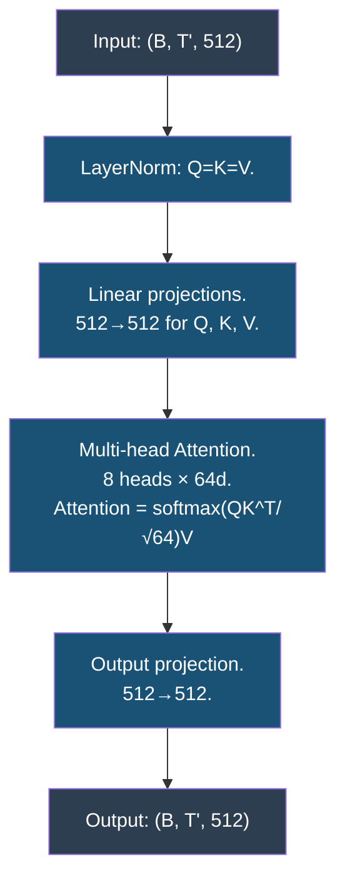
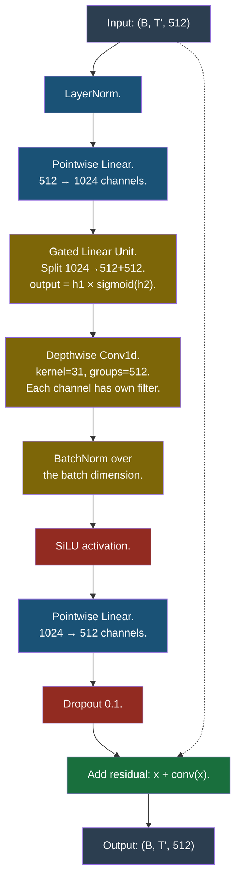
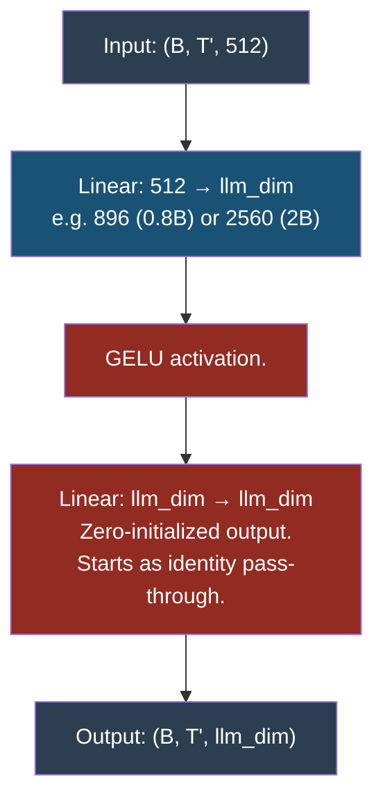
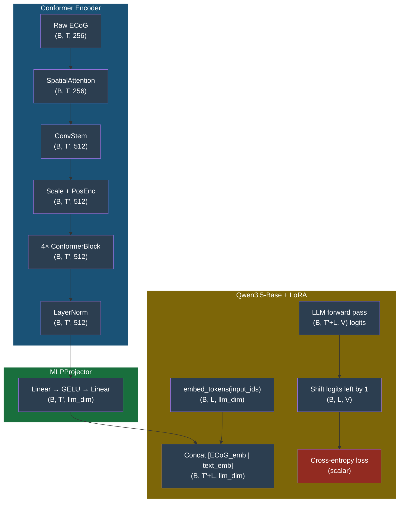

# E2E BCI Pipeline — Architecture Reference

**Last Updated:** 2026-05-03
**Status:** LLaVA-style architecture validated and tuned; current best **WER=0.3043 (v5, full test set)** vs 0.3068 (v4). Optimization-side levers exhausted — next step is **cross-attention decoder** to remove the text self-attention shortcut. See Section 6.
**Maintained by:** Update this document whenever an architecture change is made.

---

## Table of Contents

1. [Overview](#1-overview)
2. [Data Pipeline](#2-data-pipeline)
3. [Model Architecture](#3-model-architecture)
4. [Training](#4-training)
5. [Inference / Evaluation](#5-inference--evaluation)
6. [Known Bugs and Issues](#6-known-bugs-and-issues)
7. [Experiment Log](#7-experiment-log)
8. [Quick Reference](#8-quick-reference)

---

## 1. Overview

**Goal:** Map ECoG signals directly to free-form text without a phoneme intermediate.

**Architecture style:** LLaVA-style concatenation — ECoG features are encoded by a Conformer, projected by an MLP, concatenated with text embeddings, and fed to a decoder-only LLM (Qwen3.5-Base) with LoRA.

**Pipeline:**
```
ECoG (B, T, 256)
  → ConformerEncoder      → (B, T', 512)   [T' ≈ T/4 after ConvStem subsampling]
  → MLPProjector          → (B, T', llm_dim)
  → concat [ECoG | BOS | text]  → (B, T'+L_text, llm_dim)
  → Qwen3.5-Base + LoRA  → logits
  → CE loss on text positions only
```

The ConformerEncoder internally consists of: SpatialAttention → ConvStem → Scale + Sinusoidal PE → 4× ConformerBlock → LayerNorm. Each ConformerBlock (see Section 3.6) contains: FFN½ → Multi-Head Self-Attention → ConformerConvModule → FFN½ → LayerNorm.

**Files:** `AnalysisExamples/e2e/`

| File | Purpose |
|---|---|
| `conformer_pt.py` | PyTorch Conformer encoder |
| `model.py` | Full E2E model (encoder + projector + LLM + LoRA) |
| `dataset.py` | TFRecord → PyTorch Dataset; per-session z-score normalization |
| `train.py` | Phase 1 (projector warmup) + Phase 2 (joint fine-tuning) |
| `eval.py` | Greedy decode → WER/CER |

---

## 2. Data Pipeline

### 2.1 Raw Data Source

TFRecord files produced by `NeuralDecoder/rnn_step1_makeTFRecords.py`.
Each TFRecord entry contains:
- `inputFeatures`: `(n, 256)` float32 — ECoG features, 20ms bins
- `nTimeSteps`: `n` — number of valid timesteps
- `transcription`: `(500,)` int64 — ASCII-encoded text (trailing zeros = padding)
- `nSeqElements`: number of text tokens

Directory convention:
```
{data_dir}/{session}/train/*.tfrecord
{data_dir}/{session}/test/*.tfrecord
```

### 2.2 Session List

**Training (24 sessions):** `train.py:41-48`
```python
ALL_SESSIONS = [
    "t12.2022.04.28", "t12.2022.05.05", "t12.2022.05.17", "t12.2022.05.19",
    "t12.2022.05.24", "t12.2022.05.26", "t12.2022.06.02", "t12.2022.06.07",
    "t12.2022.06.14", "t12.2022.06.16", "t12.2022.06.21", "t12.2022.06.23",
    "t12.2022.06.28", "t12.2022.07.05", "t12.2022.07.14", "t12.2022.07.21",
    "t12.2022.07.27", "t12.2022.07.29", "t12.2022.08.02", "t12.2022.08.11",
    "t12.2022.08.13", "t12.2022.08.18", "t12.2022.08.23", "t12.2022.08.25",
]
```

**Eval (19 sessions):** `eval.py:35-41` — sessions `t12.2022.06.23`, `t12.2022.07.29`, `t12.2022.08.18`, `t12.2022.08.23`, `t12.2022.08.25` are missing from eval.
> ⚠️ **TODO:** `eval.py` should use the same 24 sessions as training.

### 2.3 Per-Session Z-Score Normalization

**File:** `dataset.py:94-98` (`_compute_session_stats`)

```python
all_feats = np.concatenate([e["ecog"] for e in examples], axis=0)  # (N_total, 256)
mean = all_feats.mean(axis=0, keepdims=True)   # (1, 256)
std  = all_feats.std(axis=0, keepdims=True) + 1e-6  # (1, 256)
```

- Stats are computed on the **train split only**, cached to `_norm_stats.pkl`, and reused for val/test.
- `1e-6` is added to std to prevent division by zero.
- For each sample at runtime: `ecog = (ecog - mean) / std`

**Mathematical operation (per-channel z-score):**
```
ecog_normalized[i, t, c] = (ecog_raw[i, t, c] - μ_c) / (σ_c + ε)    ε = 1e-6
```
Where:
- `i` = sample index (0 to batch_size-1)
- `t` = time step index (0 to T-1)
- `c` = channel/electrode index (0 to 255)
- `μ_c, σ_c` = mean and std of electrode `c` computed across **all training timesteps** (from all sessions, train split only)

### 2.4 Data Augmentation (Training Only)

**File:** `dataset.py:210-215`

Two augmentation layers applied sequentially on z-scored data:

**a) Additive Gaussian noise**
```python
ecog = ecog + noise * (std * white_noise_sd)   # white_noise_sd=1.0
# Applied in raw (un-normalized) space; PerSessionNorm later divides by std.
# Equivalent to noise of std=white_noise_sd in normalized space.
```
**Justification for sd=1.0**: The original Willett 2023 baseline ([speech_release_baseline.yaml:47](NeuralDecoder/neuralDecoder/configs/dataset/speech_release_baseline.yaml#L47)) uses `whiteNoiseSD: 1.0` applied after normalization. Our application scales noise by per-channel std before normalization, which is mathematically equivalent. Verified during 2026-05-03 audit.

**b) Per-channel constant offset**
```python
offset = np.random.randn(1, C) * offset_sd   # offset_sd=0.2
ecog = ecog + offset
```
A single random offset is drawn per channel and applied uniformly across all timesteps.
Simulates a constant electrode impedance shift.

### 2.5 Tokenization

**File:** `dataset.py:220-244`

The tokenizer converts the text transcription into a sequence of integer token IDs.

```python
enc = tokenizer(text, max_length=64, truncation=True, add_special_tokens=False)
# enc["input_ids"]: list of token IDs for the text only, no auto BOS/EOS

# BOS prepend: skipped for Qwen3.5 since bos_token_id = None
# Manual append EOS
if eos_id is not None:  # eos_id = 151643
    input_ids = concat(input_ids, [eos_id])
```

**Qwen3.5-0.8B-Base tokenizer config:**
- `bos_token_id = None`, `add_bos_token = false` → BOS prepend is a no-op (the `if bos_id is not None` check fails)
- `eos_token_id = 151643` → EOS appended correctly
- `pad_token_id = 151643` (same as EOS)

**Concrete example for `"the cat"` (token IDs are illustrative):**

Step 1 — tokenize:
```
input_ids_raw = [跑步, 123456]   ← Qwen3.5 token IDs for "the", "cat"
```

Step 2 — append EOS:
```
input_ids = [跑步, 123456, 151643]   ← added EOS token
labels    = [跑步, 123456, 151643]   ← same sequence
```

Both `input_ids` and `labels` are the **same sequence** here. The distinction matters in how the model uses them:

**`input_ids`** — what the model sees as it processes the text
**`labels`** — what the model is being told is the correct answer (for computing loss)

The model internally shifts by one position (standard causal LM behavior): given text at position `i`, it predicts the token at position `i+1`. So `labels` tells it "the right answer at position 0 is `跑步`, at position 1 is `123456`, etc." — it always predicts the *next* token.

### 2.6 Collate Function

**File:** `dataset.py:259-294` (`bci_collate_fn`)

Pads each batch to the longest sequence in that batch:

**ECoG:**
```
ecog_padded: (B, T_max, 256)  — zeros for padded timesteps
ecog_lengths: (B,)  — valid timestep count for each sample
```

**Text:**
```
input_ids:      (B, L_max)  — padded with zeros
labels:         (B, L_max)  — padded with -100 (ignored in CE loss)
attention_mask: (B, L_max)  — padded with zeros
```
`L_max = 64` is set by `--max-text-len`. If a transcription tokenizes to fewer than 64 tokens, it is left as-is. If longer, it is truncated to 64 tokens.

---

## 3. Model Architecture

### 3.1 High-Level Data Flow

```
ECoG (B, T, 256)
    │
    │  Step 1: SpatialAttention (per-electrode gating)
    │
    │  Step 2: ConvStem (temporal subsampling 4×)
    │
    │  Step 3: Scale + Sinusoidal Positional Encoding
    │
    │  Step 4: SpecAugment (disabled by default, has a bug)
    │
    │  Step 5: 4× ConformerBlock (self-attention + convolutions)
    │
    │  Step 6: LayerNorm
    │  → ConformerEncoder output: (B, T', 512)
    │
    │  Step 7: MLPProjector (512 → llm_dim)
    │  → (B, T', llm_dim)  e.g., llm_dim=896 for Qwen3.5-0.8B
    │
    │  Step 8: Concat [ECoG embeddings | text token embeddings]
    │  → (B, T'+L_text, llm_dim)
    │
    │  Step 9: Qwen3.5-Base + LoRA
    │  → (B, T'+L_text, vocab_size) logits
    │
    │  Step 10: Shift logits, compute CE on text positions only
    ▼
CE loss (text positions only)
```

**Training vs. inference:** During training, the model is given the real text transcription as input (teacher forcing). During inference, only the ECoG is provided — the model generates text autoregressively starting from nothing.

---

### 3.2 Step 1: SpatialAttention

**File:** `conformer_pt.py:31-57`

Each of the 256 electrodes gets a scalar multiplier (a "gate") learned via self-attention over electrodes. The gate is static — the same per-electrode value is applied to all timesteps.

**Input:** `(B, T, 256)` → **Output:** `(B, T, 256)`



Key: `d_attn=64`, `nhead=4`, `ch_emb` init `N(0,0.02)`, dropout `0.1`

---

### 3.3 Step 2: ConvStem (Temporal Subsampling)

**File:** `conformer_pt.py:171-197`

A learned Conv1d with stride 4 compresses the temporal axis by ~4×. The encoder learns the optimal subsampling via backprop.

**Input:** `(B, T, 256)` → **Output:** `(B, T', 512)` where `T' = floor((T-32)/4)+1`



---

### 3.4 Step 3: Scale + Sinusoidal Positional Encoding

**File:** `conformer_pt.py:279-284`

Inject absolute position using fixed sinusoidal encodings (not learned). The formula `pe(pos,2i)=sin(pos/10000^(2i/d))` generates a unique encoding for each timestep position.

**Input:** `(B, T', 512)` → **Output:** `(B, T', 512)`



---

### 3.5 Step 4: SpecAugment

**File:** `conformer_pt.py:64-88`

Regularization by randomly zeroing out 2 frequency bands and 2 time bands. Forces the model to be robust to missing features.

**Input:** `(B, T', 512)` → **Output:** `(B, T', 512)` — same shape, some regions zeroed



---

### 3.6 Step 5: ConformerBlock × 4

**File:** `conformer_pt.py:140-164`

Each block combines global self-attention (long-range dependencies) with local convolutions (fine-grained temporal patterns). Order: FFN½ → MHSA → Conv → FFN½ → LayerNorm.

**Input:** `(B, T', 512)` → **Output:** `(B, T', 512)`



#### 3.6.1 FeedForward Module

**File:** `conformer_pt.py:124-137`



#### 3.6.2 Multi-Head Self-Attention

**File:** `conformer_pt.py:149-150`



#### 3.6.3 ConformerConvModule

**File:** `conformer_pt.py:95-121`



---

### 3.7 Step 6: Encoder Output LayerNorm

**File:** `conformer_pt.py:301`

```python
return self.norm(x), out_len
```

A final `LayerNorm(512)` applied to the output of the last ConformerBlock.
**Output:** `(B, T', 512)` — same shape as input.

---

### 3.8 Step 7: MLPProjector

**File:** `model.py:31-48`

Maps Conformer output (512-dim) to the LLM's embedding dimension (e.g. 896 for 0.8B, 2560 for 2B). The output linear layer is zero-initialized so the model starts with a "blank" ECoG prefix.

**Input:** `(B, T', 512)` → **Output:** `(B, T', llm_dim)`



---

### 3.9 Full Model Integration (Steps 8–12)

**ConvStem** (Convolution Stem): A 1D convolution with kernel=32, stride=4 that temporally subsamples the ECoG signal by ~4×. A raw ECoG sequence of ~600 timesteps becomes ~137 timesteps, matching the LLM's context window. This is a learned operation — backprop trains it to subsample in a way that preserves speech information.



Where `V` = vocabulary size (~151,936 for Qwen3.5), `L` = text token sequence length (padded to max_text_len=64), and `llm_dim` = 896 for Qwen3.5-0.8B.

**Training:** ECoG → Conformer → Projector → concat [ECoG_emb | text_emb] → LLM → shift logits → CE on text positions only.

**Inference:** ECoG → Conformer → Projector → concat [ECoG_emb | BOS_emb] → `llm.generate()` autoregressively.

---

### 3.10 Step 9: LLM Forward (Qwen3.5-Base + LoRA)

**File:** `model.py:179-182`

```python
out = self.llm(
    inputs_embeds=inputs_embeds,
    attention_mask=full_attention_mask,
)
# out.logits: (B, T'+L_text, vocab_size)  — raw logits for every position
```

**What this does:**

The Qwen3.5-Base model is a decoder-only transformer with 22 layers (for the 0.8B variant). It processes the concatenated sequence `[ECoG_emb | text_emb]` of shape `(B, T'+L, llm_dim)` through its full stack of self-attention and feed-forward layers.

At each transformer layer, every token attends to all preceding tokens (causal masking). So by the time the sequence reaches the final layer, each position has a "view" of the entire prefix:
- ECoG token at position `t` sees: ECoG tokens `[0..t]`
- Text token at position `T'+k` sees: ECoG tokens `[0..T']` AND text tokens `[T'..T'+k]`

The output of the final layer is a logit vector of shape `(B, T'+L, V)` — one raw score per vocabulary token for every position in the sequence.

**LoRA adaptation:**
- `r=16`, `alpha=32`, `dropout=0.05`
- Applied to: `q_proj`, `k_proj`, `v_proj`, `o_proj` (the four projection matrices in self-attention)
- LoRA params are the only trainable LLM parameters (unless `freeze_llm=True`)
- Total trainable: ~4M params out of 783M total

LoRA injects trainable low-rank matrices alongside the frozen pretrained weights:
- `W_q_new = W_q + (A @ B)` where `A ∈ R^{d×r}`, `B ∈ R^{r×k}`, `r=16`
- This lets the model adapt to ECoG→text mapping without modifying the pretrained weights

---

### 3.11 Step 10: Loss — Extract Text Logits and Compute CE

**File:** `model.py:184-193`

```python
T_prime = ecog_embs.shape[1]          # e.g., 137

# Shift: position i predicts label i+1
# ⚠️ BUG: off-by-one. Should be T_prime:, :-1
text_logits = out.logits[:, T_prime - 1 : -1, :]   # (B, L_text, V)
text_labels = labels                                      # (B, L_text)

loss = F.cross_entropy(
    text_logits.reshape(-1, V),
    text_labels.reshape(-1),
    ignore_index=-100,
    label_smoothing=self.label_smoothing,
)
```

**Step-by-step:**

1. **`out.logits[:, T_prime - 1 : -1, :]`** — slices the logit tensor to extract only the text positions:
   - `T_prime - 1 : -1` means "from the second-to-last ECoG position to the last position" (this is the bug — should be `T_prime:`)
   - After slicing: shape `(B, L_text, V)` where `L_text` is the text token length
   - This is the "shift" — causal LM internally predicts position `i+1` from position `i`, so we extract the logits that correspond to predicting the text tokens

2. **`labels`** — the ground truth token IDs from the dataset:
   - Shape `(B, L_text)`
   - Contains token IDs for the text sequence: `[tok_0, tok_1, ..., tok_{L-1}, EOS]`
   - Positions corresponding to ECoG tokens are set to `-100` (ignored by CE)

3. **`F.cross_entropy(...)`** — computes the standard cross-entropy loss:
   - Flattens logits to `(B·L_text, V)` and labels to `(B·L_text,)`
   - For each position, computes `softmax(logits)` → compares against the target token ID
   - `ignore_index=-100` skips the ECoG prefix positions
   - `label_smoothing=0.0` by default (can be set to 0.1 for regularization)

**What the shift means:**

Causal language modeling works by next-token prediction. The LLM at position `p` outputs a probability distribution over the vocabulary — "given everything before position `p`, what token comes next?"

For the text positions (indices `T'` through `T'+L-1`):
- Position `T'` should predict `tok_0` (the first text token)
- Position `T'+1` should predict `tok_1`
- ...
- Position `T'+L-1` should predict `EOS`

The `out.logits[:, T_prime:, :]` tensor gives us exactly these predictions — one logit vector per text position. We compare these against the ground truth labels to compute loss.

> ⚠️ **BUG:** `T_prime - 1` should be `T_prime`. The current slice starts one position too early, pulling in the last ECoG logit instead of the first text logit.

---

### 3.12 Generation (Inference)

**File:** `model.py:194-237` (`generate`)

```python
ecog_embs, ecog_len = self._encode_ecog(ecog, ecog_lengths)  # (B, T', llm_dim)

bos_id = tokenizer.bos_token_id or tokenizer.eos_token_id   # = 151643 for Qwen3.5
bos_emb = self._text_embeddings(torch.full((B,1), bos_id))  # (B, 1, llm_dim)

inputs_embeds = concat([ecog_embs, bos_emb], dim=1)          # (B, T'+1, llm_dim)
# ECoG tokens see full prefix; BOS token is the generation kickstart

generated = llm.generate(
    inputs_embeds=inputs_embeds,
    attention_mask=concat([ecog_attn, ones(B,1)], dim=1),
    max_new_tokens=64,
    num_beams=1,              # greedy by default
    do_sample=False,
    eos_token_id=151643,
    pad_token_id=151643,
    repetition_penalty=1.2,
)
# generated: (B, max_new_tokens) — only the NEW tokens
texts = tokenizer.batch_decode(generated, skip_special_tokens=True)
```

**Key design decisions:**
- Generation uses `inputs_embeds` (continuous embeddings) not `input_ids`
- BOS embedding is computed and concatenated, but the LLM autoregressively generates from this starting point
- `repetition_penalty=1.2` penalizes previously generated tokens
- `do_sample=False` + `num_beams=1` = pure greedy decoding

---

## 4. Training

### 4.1 Two-Phase Training

**Phase 1 — Projector Warmup** (`train.py:271-273`)

Only the MLPProjector is trainable. LLM and Conformer encoder are frozen.

```
LR: projector = 1e-4 (default)
Steps: 300 (default)
Batch size: 4 (default)
Effective batch: 4
```

**Phase 2 — Joint Fine-Tuning** (`train.py:274-279`)

All three components train simultaneously.

```
LR: encoder = 5e-5, projector = 1e-4, LoRA = 2e-4 (defaults)
Steps: up to 20000
Batch size: 24 (default) × grad_accum=2 = effective batch 48
```

### 4.2 Optimizer and Scheduler

**Optimizer:** `AdamW(opt_groups, weight_decay=0.01)`

**Scheduler:** Cosine annealing with linear warmup (`train.py:55-64`)

```
LR(step) = {
    step / warmup_steps,                    if step < warmup_steps
    max(min_lr_ratio, 0.5 * (1 + cos(π * (step - warmup_steps) / (total - warmup_steps)))),
                                           otherwise
}
min_lr_ratio = 0.1
```

**Default warmup:** 500 steps (Phase 1=300, so warmup completes during Phase 2)

### 4.3 Gradient Accumulation

**File:** `train.py:315-331`

```python
for micro_step in range(grad_accum):
    loss = model(...)
    (loss / grad_accum).backward()          # scaled per micro-batch
    accum_loss += loss.item() / grad_accum

optimizer.step()
scheduler.step()
# global_step += 1  (counts optimizer steps, NOT micro-steps)
```

Effective batch = `batch_size × grad_accum`. Default: 24 × 2 = 48.

### 4.4 Gradient Clipping

**File:** `train.py:333`

```python
nn.utils.clip_grad_norm_(model.parameters(), max_norm=1.0)
```

### 4.5 Checkpointing

**File:** `train.py:67-78`

Saved to `checkpoint.pt`:
- `step`, `best_wer`, `args`
- Full model state dict
- Optimizer state dict
- Scheduler state dict

The "best" checkpoint is saved to `best/` subdirectory whenever val WER improves.

**Resuming:** Auto-resumes from `checkpoint.pt` in `--output-dir`.

### 4.6 Validation

**File:** `train.py:182-210`

- Runs greedy decode on up to 50 batches
- Computes `val_loss` and `val_wer`
- Updates `best_wer` and saves "best" checkpoint if WER improved

---

## 5. Inference / Evaluation

### 5.1 Eval Loop

**File:** `eval.py:87-178`

```python
for batch in test_loader:
    texts = model.generate(ecog, ecog_len, tokenizer, max_new_tokens=64, beam=1)
    all_hyps.extend(texts)
    all_refs.extend(batch["texts"])
```

### 5.2 Metrics

**WER** (`eval.py:58-70`):
```python
wer = total_edit_distance / total_reference_words
```
Lowercased, word-split. Edit distance via dynamic programming.

**CER** (`eval.py:73-80`):
```python
cer = total_edit_distance / total_reference_chars
```
Lowercased, spaces removed, character-level edit distance.

### 5.3 Beam Search

Controlled by `--beam N` flag in `eval.py:196`. Default is 1 (greedy).
> **Observation:** beam=5 performs *worse* than beam=1 (WER 0.64→0.67). The model is too imperfect for beam exploration — beam search propagates errors.

---

## 6. Known Issues and Root Cause Analysis

### Critical: Text Self-Attention Shortcut (still suspected, no longer proven by encoder collapse)

The LLaVA-style concat architecture allows the LLM's self-attention to predict next text tokens from preceding text tokens, potentially bypassing ECoG. The earlier "encoder collapsed" evidence (cosine sim 0.90–0.97) was on broken pre-fix runs and **does not apply to the current pipeline**.

**Updated evidence from 2026-05-03 v4 audit** ([experiments/e2e_v4/tests/](experiments/e2e_v4/tests/)):
- Encoder is **functional**: between-utterance cosine sim **0.79** (vs within=1.0), gap=0.21 — encoder discriminates utterances.
- Encoder **uses ECoG**: zeroed-ECoG WER 0.98 vs real-ECoG WER 0.53 — ratio 1.84×, real ECoG matters.
- Encoder swap test: v4's projector+LoRA can drive train loss to 0.002 given v4's encoder features. **Capacity is not the bottleneck.**
- v4 best full-set WER = **0.3068** (vs train-time partial val 0.3626 — partial val sampled the harder utterances).

**The remaining gap (0.31 → 0.20 baseline) is a generalization problem, not a capacity problem.** v5 (continuation with corrected LRs and stronger reg) only moved partial val_WER from 0.3626 → 0.3585 — confirming optimization-side levers are nearly exhausted.

**Why cross-attention is the next step**: a structural fix where text attends only to ECoG (not to itself) prevents the shortcut by construction.

### Additional Issues

| Priority | File | Issue | Impact |
|---|---|---|---|
| **HIGH** | `eval.py` | eval uses 19 sessions; train uses 24 | Eval numbers don't reflect training distribution. **Verify and fix before next eval.** |
| **NONE** | (resolved) `model.py` off-by-one loss slice | Was bug 6 in prior plan — fixed during v4 prep |
| **NONE** | (resolved) `white_noise_sd=1.0` | Verified to match Willett 2023 baseline; no change needed |

---

## 7. Experiment Log

### E2E LLaVA-Style Experiments (current pipeline)

| Run | Model | Sessions | Train Steps | Best partial val_WER | Full-set WER | CER | Notes |
|---|---|---|---|---|---|---|---|
| **`e2e_v4`** | Qwen3.5-0.8B | 24 | 15000 | 0.3626 | **0.3068** | 0.2862 | First clean run after dtype + GatedDeltaNet hook fixes; CTC encoder init + LayerNorm projector + empty-think seed |
| **`e2e_v5`** | Qwen3.5-0.8B | 24 | 5000 (continuation from v4) | **0.3585** | **0.3043** | 0.2867 | LR/regularization fix: lr_encoder 5e-5, lr_lora 1e-5, lora_dropout 0.2, wd 0.1. Modest +0.4% absolute over v4 partial / +0.25% on full. Best at step 2000; later steps plateaued. |

### E2E Audit Tests (2026-05-03 on v4/best)

| Test | Result | Conclusion |
|---|---|---|
| `check_encoder.py` | within-sim=1.00, between-sim=0.79 (gap 0.21); WER_real=0.53, WER_zero=0.98 (ratio 1.84×) | Encoder is functional and uses ECoG |
| `encoder_swap_test.py` (pretrained CTC) | mean train loss 0.74 over 200 steps after projector mismatch | Pretrained features usable but require projector re-fit |
| `encoder_swap_test.py` (v4 baseline) | train loss → 0.002 in 20 steps | Massive memorization capacity → bottleneck is **generalization**, not capacity |
| `lr_range_test.py` (encoder) | min loss at lr=6.89e-4; Smith→6.89e-5 | v4's 2e-4 was 3× too high |
| `lr_range_test.py` (lora) | min loss at lr=7.56e-5; Smith→7.56e-6 | v4's 5e-5 was 7× too high |
| `rep_penalty_sweep.py` (full set) | spread 0.0009 (0.09%) across {1.0..1.3} | rep_penalty is irrelevant for this model — set to 1.0 |

### Historical (broken pipeline, pre-2026-05-01)

The runs below were on the dtype-broken / pre-LayerNorm-projector / pre-empty-think pipeline. They are kept for context but do **not** reflect the current architecture.

| Run | Model | Sessions | WER | Notes |
|---|---|---|---|---|
| `e2e_0.8b` | Qwen3.5-0.8B | 24 | 0.8413 | Generated long generic paragraphs |
| `e2e_0.8b_v2/v3/fixed` | 0.8B | 24 | 1.0+ | Various crashes/regressions |
| `e2e_2b_v2` | 2B | 24 | 2.17 | Larger LLM overfit immediately |

> **eval_recheck.json** on `e2e_0.8b/best` (24 sessions): WER=7.30, model generates multi-paragraph stories. This confirms the model learned to generate generic text, not decode ECoG.

### Two-Stage Baseline (for comparison)

| System | WER | CER |
|---|---|---|
| GRU two-stage | 0.1895 | 0.1362 |
| Conformer two-stage | 0.2141 | 0.1466 |

---

## 8. Quick Reference

### Training Commands (current — empirically tuned)

**v4-style fresh run (CTC encoder init + LayerNorm projector + empty-think seed)** — what produced best WER 0.3068:
```bash
source /workspace/venv/bin/activate
cd /workspace/speechBCI

python -u AnalysisExamples/e2e/train.py \
  --data-dir data/derived/tfRecords \
  --lm Qwen/Qwen3.5-0.8B-Base \
  --output-dir experiments/e2e_v4 \
  --init-encoder-from experiments/ctc_4l/best \
  --reset-optimizer --phase 2 --max-steps 15000 \
  --batch-size 8 --grad-accum 4 --num-workers 4 \
  --lr-encoder 2e-4 --lr-projector 2e-4 --lr-lora 5e-5 \
  --lora-r 16 --weight-decay 0.05 --lora-dropout 0.1 \
  --warmup-steps 200 --patience 0 \
  --eval-every 500 --save-every 1000 --log-every 50 \
  --label-smoothing 0.1 --max-text-len 64
```

**v5-style continuation (corrected LRs + stronger reg)** — what produced best WER 0.3585 partial:
```bash
python -u AnalysisExamples/e2e/train.py \
  --data-dir data/derived/tfRecords \
  --lm Qwen/Qwen3.5-0.8B-Base \
  --output-dir experiments/e2e_v5 \
  --init-weights-from experiments/e2e_v4/best \
  --reset-optimizer --phase 2 --max-steps 5000 \
  --batch-size 8 --grad-accum 4 --num-workers 4 \
  --lr-encoder 5e-5 --lr-projector 1e-4 --lr-lora 1e-5 \
  --lora-r 16 --weight-decay 0.1 --lora-dropout 0.2 \
  --warmup-steps 100 --patience 0 \
  --eval-every 500 --save-every 1000 --log-every 50 \
  --label-smoothing 0.1 --max-text-len 64
```

**Evaluate checkpoint (full test set, 880 examples):**
```bash
python AnalysisExamples/e2e/eval.py \
  --data-dir data/derived/tfRecords \
  --ckpt experiments/e2e_v4/best \
  --lm Qwen/Qwen3.5-0.8B-Base \
  --beam 1 --batch-size 8 \
  --output experiments/e2e_v4/eval_full.json
```

**Audit tests (run on any best checkpoint):**
```bash
# Encoder discriminability + zeroed-ECoG WER
python AnalysisExamples/e2e/check_encoder.py --data-dir ... --ckpt ... --lm ...

# LR range test (Smith 2017)
python AnalysisExamples/e2e/lr_range_test.py --target {encoder|lora|projector} ...

# Encoder swap test (proves capacity vs. encoder bottleneck)
python AnalysisExamples/e2e/encoder_swap_test.py --base-ckpt ... --encoder-ckpt ...

# Repetition penalty sweep
python AnalysisExamples/e2e/rep_penalty_sweep.py --penalties 1.0 1.05 1.1 1.2 1.3 ...
```

### Key Hyperparameters

| Parameter | Default | Notes |
|---|---|---|
| `d_model` | 512 | Conformer hidden dimension |
| `nhead` | 8 | MHSA heads in ConformerBlock |
| `num_layers` | 4 | ConformerBlocks |
| `d_ff` | 2048 | FFN inner dimension |
| `stem_stride` | 4 | Temporal subsampling rate |
| `lora_r` | 16 | LoRA rank |
| `lora_alpha` | 32 | LoRA scaling (alpha/r = 2) |
| `label_smoothing` | 0.0 | Set to 0.1 for regularization |
| `batch_size` | 24 | Phase 2 micro-batch size |
| `grad_accum` | 2 | Effective batch = 48 |
| `max_new_tokens` | 64 | Generation length |

### Environment

- **GPU:** RTX 5090 (32 GB VRAM)
- **Python venv:** `/workspace/venv` (PyTorch 2.12 nightly + TF 2.21)
- **TFRecord reading:** TensorFlow (CPU-only, set via `tf.config.set_visible_devices([], "GPU")`)

### Current model.py State

All historical bugs fixed:
- `session_ids` plumbed through `forward`, `generate`, `_encode_ecog`
- `build_per_session_norm()` defined on `E2EBCIModel` (delegates to encoder)
- Off-by-one CE slice fixed: `out.logits[:, T_prime:-1, :]` aligned with `labels = input_ids_full[1:]`
- Projector is `Linear → LayerNorm` (norm-matched to LLM embedding scale, fixes 19× norm mismatch)
- GatedDeltaNet pre-hook forces bf16 inputs (Qwen3.5 fallback path crash)
- `generate()` is fully wrapped in `torch.autocast("cuda", dtype=torch.bfloat16)`
- Empty think block seed `[<think>, \n, </think>, \n]` used in both training prefix and inference seed (Qwen3.5 enable_thinking=False equivalent)

### What Next?

After 2026-05-03 audit, the optimization-side levers (LR, regularization, augmentation) are exhausted. The remaining 0.31 → 0.20 gap requires structural change:

1. **Cross-attention decoder** (priority — recommended next move): LLM attends only to ECoG via cross-attention; text self-attention cannot see ECoG positions directly. Structurally eliminates the shortcut. Requires writing a new model variant; cannot reuse v4's LoRA weights (different attention modules) or v4's projector (different role).
2. **Pretrain encoder on LibriSpeech**: Conformer learns speech features from a larger corpus before fine-tuning on ECoG. Aligns with how CLIP-style models work.
3. **Use two-stage Conformer as frozen feature extractor**: phoneme-decoding Conformer features are highly discriminative — freeze it and only train the projector + LM bridge. Cheap to test if compute constrained.

---

*End of PIPELINE.md*
