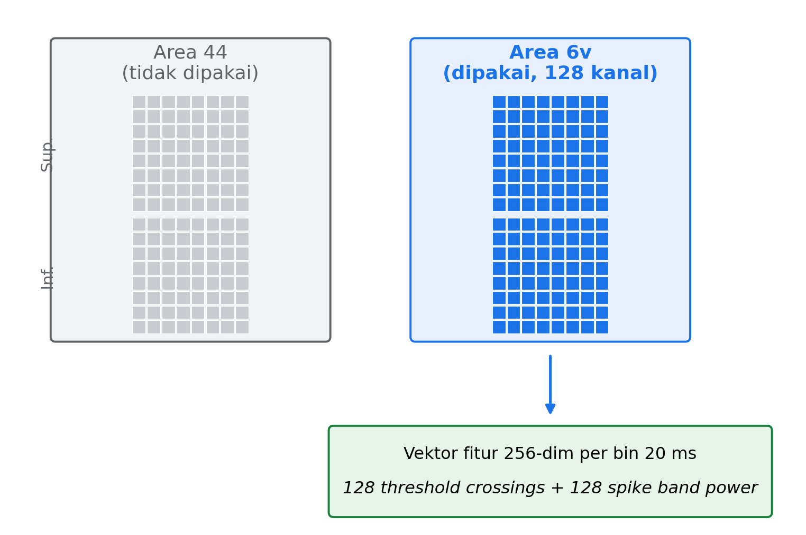
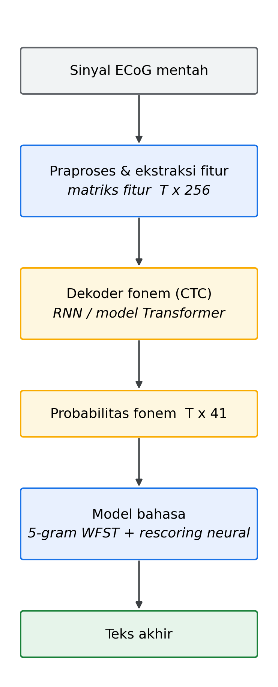
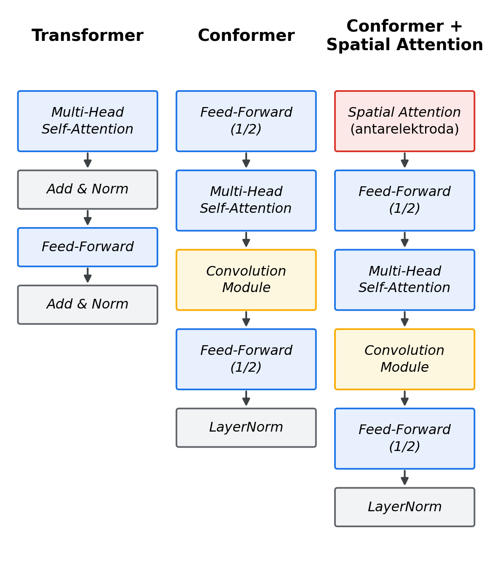
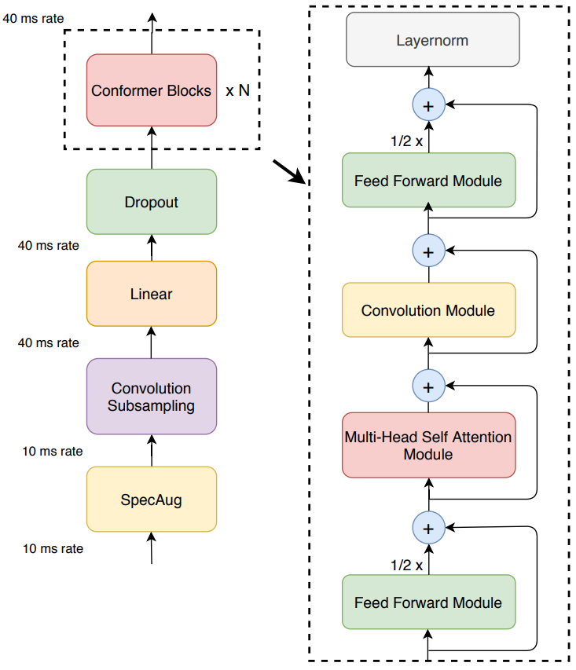
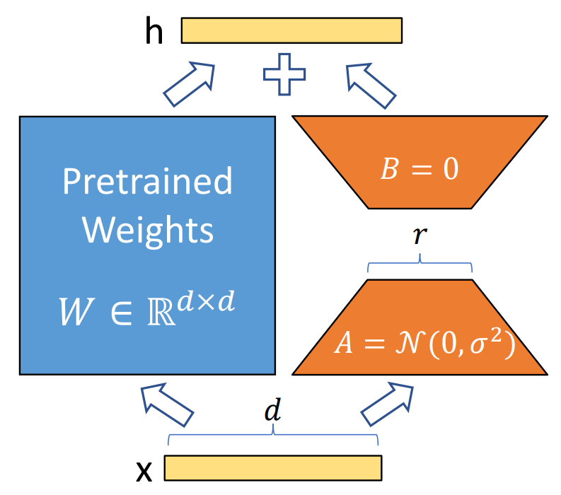

# BAB II KAJIAN PUSTAKA

Bab ini membahas pustaka yang menjadi dasar pengembangan sistem *neuroprosthesis* bicara serta penelitian terkait. Bagian II.1 menjelaskan konsep *brain-computer interface* beserta akuisisi sinyal ECoG. Bagian II.2 mendeskripsikan dataset yang digunakan pada tugas akhir ini. Bagian II.3 menjabarkan alur pemrosesan sinyal ECoG menjadi teks. Bagian II.4 membahas arsitektur model berbasis Transformer beserta variannya. Bagian II.5 menjelaskan *Foundation Model* beserta teknik adaptasi dan penyetelannya. Terakhir, bagian II.6 memaparkan penelitian terkait.

## II.1 Brain-Computer Interface (BCI)

*Brain-Computer Interface* (BCI) adalah sistem yang membangun jalur komunikasi langsung antara otak dan perangkat eksternal sehingga melewati jalur neuromuskular konvensional tubuh (Moses et al., 2021; Shih et al., 2012). Teknologi ini penting bagi individu dengan gangguan neurologis berat yang mengalami kelumpuhan seperti *amyotrophic lateral sclerosis* (ALS), stroke batang otak, atau cedera sumsum tulang belakang tingkat tinggi (Beukelman et al., 2007; Moses et al., 2021). Kondisi seperti ALS ditandai dengan pelumpuhan progresif pada neuron motorik yang menyebabkan hilangnya kendali otot secara drastis. Pada tingkat lanjut, hal ini dapat mengakibatkan kondisi *locked-in*, yaitu kondisi ketika fungsi kognitif seseorang tetap utuh, tetapi kemampuan untuk berbicara atau bergerak hilang sepenuhnya (Moses et al., 2021). Studi menunjukkan bahwa 80% hingga 95% individu dengan ALS pada akhirnya akan kehilangan kemampuan untuk mengeluarkan ucapan. Akibatnya, kualitas hidup mereka menurun secara drastis dan koneksi penderita dengan dunia sosial terputus (Beukelman et al., 2007). BCI menyediakan alternatif untuk memulihkan kemampuan dasar manusia ini dengan menciptakan saluran komunikasi yang tidak memerlukan kendali otot.

Perangkat *augmentative and alternative communication* (AAC) dapat menjadi alternatif, tetapi memiliki keterbatasan tersendiri. Teknologi tersebut tetap memerlukan kemampuan mengontrol otot yang dapat menurun seiring berkembangnya tingkat keparahan penyakit (Moses et al., 2021). Lebih lanjut, perangkat ini sering kali lambat dan melelahkan dengan kecepatan komunikasi yang jauh di bawah kecepatan bicara rata-rata manusia, yaitu 160 kata per menit (Willett et al., 2023). Keterbatasan yang mencolok ini menciptakan kebutuhan yang jelas akan saluran komunikasi yang tidak hanya terpisah dari kontrol motorik, tetapi juga mampu mencapai *bandwidth* komunikasi yang lebih tinggi.

### II.1.1 Paradigma Komunikasi BCI

Paradigma BCI memberikan definisi tentang aksi tertentu atau stimulus eksternal yang digunakan untuk menyandikan maksud pengguna menjadi sinyal otak yang dapat diproses. Secara historis, paradigma yang umum dan telah dipelajari dengan baik adalah *P300 speller* (Shih et al., 2012). Dalam sistem ini, pengguna disajikan dengan kisi-kisi karakter, dan seiring dengan adanya baris dan kolom yang berkedip secara berurutan, pengguna memfokuskan perhatian pada karakter yang diinginkan. BCI dilatih untuk mendeteksi gelombang otak yang dikenal sebagai peristiwa P300. Peristiwa P300 muncul dalam sinyal EEG sekitar 300 milidetik setelah pengguna menerima stimulus yang merupakan target pada tugasnya, yaitu kedipan karakter yang ingin dieja (Shih et al., 2012). Dengan mengidentifikasi kedipan baris dan kolom mana yang memicu respons P300, sistem dapat menentukan karakter yang dipilih. Meskipun efektif, metode ini pada dasarnya bersifat serial dan memerlukan setiap karakter untuk dieja satu per satu sehingga memperlambat *bandwidth* komunikasi.

Paradigma yang lebih maju bertujuan mendekode langsung maksud motorik atau ucapan pengguna. Sistem ini mencoba menafsirkan perintah saraf yang terkait dengan tindakan yang diinginkan. Misalnya, pengguna membayangkan atau mencoba menggerakkan tangannya untuk mengontrol kursor. Sebagai contoh dalam *neuroprosthesis* bicara, pengguna membayangkan atau mencoba pengucapan kata atau kalimat (Moses et al., 2021). BCI dirancang untuk menerjemahkan pola aktivitas pada otak yang dihasilkan selama suatu tindakan dilakukan secara langsung menjadi perintah atau keluaran teks yang sesuai.

### II.1.2 Metode Akuisisi Sinyal pada BCI

Sistem BCI dapat dikategorisasi berdasarkan metode akuisisi sinyalnya menjadi invasif atau noninvasif. Kedua pilihan ini memiliki *trade-off* antara keamanan dan kualitas sinyal.

Metode noninvasif seperti elektroensefalografi (EEG) merekam aktivitas listrik otak dari elektroda yang dipasang di kulit kepala (Shih et al., 2012). EEG bersifat aman, relatif murah, dan portabel sehingga banyak digunakan dalam penelitian dan klinis. Namun, kegunaannya untuk BCI berkinerja tinggi sangat terbatas. Saat sinyal saraf bergerak dari korteks ke kulit kepala, sinyal tersebut dilemahkan dan dikaburkan secara spasial oleh lapisan di antaranya, terutama tengkorak. Hal ini menghasilkan *signal to noise ratio* (SNR) yang rendah, resolusi spasial yang buruk dalam orde beberapa sentimeter, dan kerentanan tinggi terhadap artefak dari aktivitas otot seperti kedipan mata atau gerakan rahang (Schalk & Leuthardt, 2011).

Metode invasif digunakan untuk mengatasi keterbatasan ini. Elektrokortikografi (ECoG) adalah metode akuisisi sinyal yang dilakukan dengan meletakkan serangkaian elektroda secara langsung ke permukaan otak melalui prosedur bedah. Elektroda umumnya diletakkan di ruang subdural di bawah dura mater (Schalk & Leuthardt, 2011). Prosedur bedah yang dilakukan bernama kraniotomi, yaitu prosedur yang membawa risiko seperti infeksi dan pendarahan. Namun, dengan menempatkan sensor di dekat sumber saraf, ECoG menghindari efek distorsi tengkorak. Hasilnya adalah sinyal dengan SNR yang jauh lebih unggul, resolusi spasial yang jauh lebih tinggi dalam orde milimeter, dan *bandwidth* frekuensi yang lebih luas dibandingkan dengan EEG (Michel & Murray, 2011; Schalk & Leuthardt, 2011). Untuk tugas kompleks dan berkecepatan tinggi seperti mendekode sinyal saraf dari ucapan kalimat dengan kosakata beragam, kualitas sinyal yang ditawarkan EEG umumnya tidak mencukupi. Oleh karena itu, kualitas data yang ditawarkan ECoG diperlukan untuk mampu melakukan dekode dengan kinerja tinggi.

### II.1.3 Elektrokortikografi (ECoG)

ECoG merupakan jenis elektroensefalografi intrakranial yang merekam aktivitas listrik secara langsung dari permukaan korteks serebral (Metzger et al., 2023). Prosedur klinisnya melibatkan kraniotomi untuk menghasilkan bukaan sementara pada tengkorak dan membuka dura mater, yaitu membran luar otak. Dura mater kemudian diiris untuk memperlihatkan permukaan kortikal. Serangkaian elektroda kemudian ditempatkan di ruang subdural otak (Schalk & Leuthardt, 2011). Susunan elektroda tersebut biasanya dibentuk dari bahan yang bersifat biokompatibel seperti karet silikon yang dibubuhi susunan elektroda cakram logam kecil dari paduan platinum-iridium atau *stainless steel* (Metzger et al., 2023). Pada sistem berkinerja tinggi, susunan yang dipakai umumnya berdensitas tinggi dan terdiri atas 253 hingga 256 elektroda dengan jarak antarpusat sebesar tiga hingga empat milimeter (Metzger et al., 2023). Sinyal saraf yang terekam ditransmisikan dari elektroda melalui kabel tipis yang disalurkan di bawah kulit menuju konektor *pedestal* perkutan yang dipasang secara bedah pada tengkorak. Konektor ini berfungsi sebagai tempat pemasangan *headstage* digital untuk melakukan digitalisasi dan transmisi data neural menuju komputer untuk pemrosesan (Metzger et al., 2023; Simeral et al., 2021).

### II.1.4 Produksi Ucapan dalam Otak

Produksi ucapan merupakan salah satu perilaku motorik paling kompleks yang dapat dilakukan manusia. Produksi ucapan memerlukan koordinasi yang tepat dan cepat untuk lebih dari 100 otot yang mengendalikan sistem pernapasan, laring, serta artikulator saluran vokal seperti bibir, lidah, rahang, dan velum. Tindakan motorik rumit ini diatur oleh jaringan kortikal yang tersebar luas, terutama di daerah lobus frontal, temporal, dan parietal di hemisfer dominan bahasa yang umumnya merupakan hemisfer kiri (Indefrey, 2011).

Untuk keperluan BCI dalam ucapan, kisi ECoG diletakkan secara strategis di daerah kortikal yang memiliki peran penting dalam kontrol motorik dan artikulasi ucapan. Area penting di antaranya adalah *ventral sensorimotor cortex* (vSMC) yang mencakup sebagian dari *precentral gyrus* dan *postcentral gyrus*. Daerah tersebut mengandung representasi neural dari muka, bibir, lidah, dan laring (Metzger et al., 2023). Daerah penting lainnya di lobus frontal meliputi korteks premotor yang terlibat dalam merencanakan sekuens motorik. Selain itu, terdapat daerah seperti area Broca yang berperan dalam pemrosesan fonem dan sintaksis (Indefrey, 2011). Area lobus temporal, khususnya *superior temporal gyrus* (STG), terlibat dalam memproses umpan balik suara selama ucapan. Pemrosesan ini penting untuk memantau dan membetulkan keluaran ucapan tersendiri (Moses et al., 2021). Area tersebut umum ditargetkan pada pemasangan elektroda ECoG dengan susunan yang mencakup *precentral gyrus*, *postcentral gyrus*, *superior temporal gyrus*, serta *middle temporal gyrus* (Metzger et al., 2023; Willett et al., 2023).

## II.2 Dataset Willett et al. (2023)

Tugas akhir ini menggunakan dataset publik yang dikumpulkan oleh Willett et al. (2023). Dataset ini berisi rekaman aktivitas neural dari satu partisipan berkode T12, yaitu seorang penderita ALS yang mengalami *anarthria* sehingga ucapannya tidak lagi dapat dipahami. Data dikumpulkan selama beberapa bulan dalam 24 sesi perekaman. Pada setiap *trial*, partisipan disajikan sebuah kalimat dan diminta mencoba mengucapkannya saat diberikan isyarat oleh komputer. Perekaman dihentikan ketika partisipan menekan tombol. Pada sebagian hari, partisipan mencoba mengucapkan kalimat secara normal, sedangkan pada hari lain ia hanya menggerakkan mulut tanpa bersuara (*mouthing*) (Willett et al., 2023). Setiap *trial* memasangkan potongan waktu aktivitas neural dengan transkripsi teks dari kalimat yang dicoba diucapkan.

Aktivitas neural direkam melalui susunan mikroelektroda intrakortikal yang ditanam pada korteks partisipan. Sinyal mentah dari elektroda kemudian diolah menjadi dua jenis fitur per kanal untuk setiap *bin* waktu selebar 20 milidetik. Fitur pertama adalah *threshold crossings*, yaitu hitungan berapa kali tegangan terekam melintasi suatu ambang batas dalam satu *bin*. Pada dataset ini, ambang batas yang digunakan adalah -3,5 kali nilai *root mean square* (RMS) sinyal. Fitur kedua adalah *spike band power*, yaitu rata-rata kuadrat tegangan setelah penyaringan *high-pass* pada frekuensi 250 Hz, dalam satuan mikrovolt kuadrat. Kedua jenis fitur tersebut telah didenoise dengan teknik *linear regression reference*, yaitu penghilangan derau antarkanal dengan memprediksi dan mengurangkan komponen sinyal yang dapat diestimasi dari sinyal-sinyal lain (Willett et al., 2023). Dataset menyediakan empat varian *threshold crossings* dengan ambang berbeda, tetapi penyedia dataset menganjurkan untuk hanya menggunakan varian dengan ambang -3,5 kali RMS.

Susunan elektroda mencakup dua area kortikal, yaitu area 6v dan area 44, sehingga tersedia 256 kanal secara total. Penyedia dataset menganjurkan untuk hanya menggunakan 128 kanal pertama yang berasal dari area 6v karena area inilah yang paling informatif untuk dekode ucapan (Willett et al., 2023). Dengan demikian, setiap *bin* waktu direpresentasikan oleh vektor berdimensi 256, yaitu 128 nilai *threshold crossings* dan 128 nilai *spike band power* dari kanal area 6v. Tata letak kedua area kortikal beserta kanal yang digunakan ditunjukkan pada Gambar II.1.



**Gambar II.1** Tata letak dua area kortikal pada susunan elektroda. Hanya 128 kanal area 6v yang digunakan sehingga menghasilkan vektor fitur berdimensi 256 per *bin* waktu.

Kalimat yang digunakan pada setiap *trial* berasal dari korpus bahasa Inggris berkosakata luas, yaitu korpus Switchboard dan korpus Open Web Text. Seluruh kalimat berasal dari kosakata umum yang bervariasi (Willett et al., 2023). Secara keseluruhan terdapat sekitar 8800 *trial* latih dan 880 *trial* uji.

## II.3 Pemrosesan Sinyal ECoG Menjadi Teks

Bagian ini menjelaskan alur mendekode sinyal ECoG menjadi teks koheren sebagaimana dilakukan oleh Willett et al. (2023). Secara ringkas, proses meliputi praproses dan ekstraksi fitur neural, prediksi probabilitas fonem, konstruksi kalimat dengan model bahasa, serta pengukuran kinerja melalui metrik evaluasi. Alur lengkapnya ditunjukkan pada Gambar II.2.



**Gambar II.2** Alur dekode sinyal ECoG menjadi teks, mulai dari fitur neural hingga teks akhir melalui representasi fonem perantara.

### II.3.1 Praproses dan Ekstraksi Fitur

Sinyal ECoG mentah yang direkam dari susunan elektroda tidak langsung diteruskan ke model pembelajaran mesin. Sebelum itu, praproses dilakukan untuk mengurangi derau dan mengekstraksi fitur yang lebih informatif tentang niat pengguna. Sinyal mentah terlebih dahulu dikelompokkan menjadi jangka waktu pendek yang disebut *bin*. Proses pengelompokan ini dinamakan *temporal binning*. Pada dataset yang digunakan, lebar satu *bin* ditetapkan pada 20 milidetik (Willett et al., 2023; Metzger et al., 2023).

Untuk setiap *bin*, dihitung dua fitur per elektroda, yaitu *spike band power* dan *threshold crossings* sebagaimana dijelaskan pada bagian II.2. Dataset ini menggunakan *threshold crossings* dan *spike band power* yang menangkap aktivitas potensial di sekitar elektroda (Willett et al., 2023). Keluaran tahap ekstraksi fitur adalah matriks fitur berdimensi T x 256 dengan T sebagai jumlah *bin* waktu dalam satu ujaran.

Matriks fitur tersebut kemudian dinormalisasi dengan *z-score* per sesi untuk mengatasi variasi statistik sinyal antarsesi perekaman yang dapat bernilai cukup besar (Willett et al., 2023). Pada tahap pelatihan, diterapkan pula *Gaussian smoothing* pada dimensi waktu serta augmentasi data berupa penambahan *white noise* dan *constant offset* untuk meningkatkan ketahanan model terhadap variasi sinyal. Teknik *subsampling* pada dimensi waktu juga dilakukan, misalnya dengan faktor empat, agar panjang sekuens lebih ringkas sebelum diproses.

### II.3.2 Pemetaan Fitur ECoG Menjadi Probabilitas Fonem

Matriks fitur diteruskan ke suatu jaringan saraf berupa dekoder. Fungsi dekoder adalah mentranslasikan pola temporal dari fitur neural menjadi representasi linguistik perantara. Contoh arsitektur dekoder yang dipilih pada literatur, seperti oleh Willett et al. (2023), adalah *recurrent neural network* (RNN) berbasis *gated recurrent unit* (GRU). RNN adalah jaringan saraf yang didesain untuk memodelkan data sekuensial dengan mempertahankan keadaan tersembunyi (*hidden state*) yang mengandung informasi dari waktu sebelumnya. Akan tetapi, RNN sederhana sulit mempertahankan informasi pada sekuens yang panjang karena masalah gradien yang menghilang (*vanishing gradient*). GRU adalah varian RNN yang mengatasi keterbatasan tersebut dengan menambahkan mekanisme gerbang (*gate*), yaitu gerbang pembaruan (*update gate*) dan gerbang pengaturan ulang (*reset gate*). Kedua gerbang ini mengatur seberapa banyak informasi lama yang dipertahankan dan informasi baru yang ditambahkan ke *hidden state* sehingga GRU lebih mampu menangkap dependensi jangka panjang daripada RNN sederhana (Cho et al., 2014).

Alih-alih memprediksi kata secara langsung dari fitur neural, dekoder umumnya dilatih untuk memprediksi fonem, yaitu satuan bunyi mendasar dari suatu bahasa. Sebagai contoh, kata *cat* dalam bahasa Inggris tersusun dari fonem /k/, /æ/, dan /t/. Pendekatan ini memiliki keunggulan dari sisi kompleksitas. Karena tidak memprediksi langsung dari ribuan kemungkinan kata, jumlah kelas yang diprediksi jauh lebih sedikit. Pada penelitian Willett et al. (2023), dekoder memprediksi 39 fonem ditambah satu token jeda sehingga berjumlah 40 kelas, lalu ditambah satu token kosong (*blank*) yang dibutuhkan oleh fungsi *loss* CTC. Hal ini mengurangi kompleksitas pelatihan secara signifikan.

Salah satu tantangan dalam dekode fonem adalah panjang sekuens fitur neural yang jauh lebih besar daripada panjang sekuens fonem keluaran. Selain itu, tidak terdapat penanda waktu yang secara otomatis menyelaraskan fitur neural dengan sekuens fonem. Untuk menangani tantangan tersebut, dekoder dilatih dengan fungsi *loss connectionist temporal classification* (CTC) yang memungkinkan pelatihan pada pasangan sekuens yang belum diselaraskan (*unaligned*) (Graves et al., 2006). Untuk setiap *bin* waktu, jaringan menghasilkan distribusi probabilitas atas seluruh kelas fonem ditambah token kosong. Token kosong memungkinkan model menghasilkan keluaran ketika tidak ada fonem yang sedang dihasilkan dan berguna untuk memisahkan fonem yang berulang.

CTC mendefinisikan probabilitas sekuens fonem Y dengan menjumlahkan probabilitas seluruh penyelarasan (*alignment*) A yang valid, yaitu seluruh deret keluaran sepanjang T yang dapat direduksi menjadi Y. Probabilitas tersebut dirumuskan pada Persamaan II.1.

p(Y | X) = Σ_{A ∈ B⁻¹(Y)} Π_{t=1}^{T} p(a_t | X)        (II.1)

Pada rumus tersebut, X adalah matriks fitur masukan, a_t adalah keluaran pada *bin* waktu ke-t, dan B adalah fungsi yang menghapus token kosong dan menggabungkan keluaran berulang sehingga memetakan suatu *alignment* menjadi sekuens fonem akhir. Fungsi *loss* CTC adalah negatif logaritma dari probabilitas tersebut. Hasil akhir tahap ini adalah matriks probabilitas fonem berdimensi T x 41 dengan 41 sebagai jumlah seluruh kelas keluaran, yaitu 39 fonem, satu token jeda, dan satu token kosong.

### II.3.3 Pemetaan Fonem ke Teks

Matriks probabilitas fonem ditranslasikan menjadi teks yang koheren melalui model bahasa yang dipadukan dengan algoritma pencarian. Model bahasa adalah model statistik yang memberikan probabilitas atas suatu rangkaian kata. Hal ini umumnya dilakukan dengan memprediksi probabilitas kata berikutnya jika diberikan beberapa kata sebelumnya. Pada arsitektur dua tahap, pemetaan fonem ke teks dilakukan melalui dua langkah, yaitu dekode dengan model bahasa *n-gram* dan *rescoring* dengan model bahasa neural.

**Dekode dengan model bahasa *n-gram* berbasis WFST.** Langkah pertama adalah memakai model bahasa *n-gram*, yaitu model yang mengestimasi probabilitas suatu kata dari sejumlah kata sebelumnya. Pada tugas akhir ini digunakan model 5-*gram*. Agar dekode dapat dilakukan secara efisien, model 5-*gram* direpresentasikan sebagai *weighted finite-state transducer* (WFST). WFST adalah *finite automata* berbobot yang memetakan sekuens masukan menjadi sekuens keluaran sambil mengakumulasi bobot di sepanjang jalurnya (Mohri et al., 2002). Representasi ini menyatukan tiga tingkat pengetahuan ke dalam satu graf yang dapat ditelusuri secara seragam, yaitu token (T) yang memetakan keluaran CTC menjadi fonem, leksikon (L) yang menghubungkan fonem menjadi kata, serta tata bahasa *n-gram* (G) yang memuat aspek linguistik (Mohri et al., 2002). Komponen T dan L berperan sebagai kerangka yang menentukan jalur fonem dan kata yang sah, sedangkan model bahasa pada graf berasal dari komponen G.

Penelusuran jalur terbaik pada WFST dilakukan dengan algoritma *beam search*. Algoritma ini membangun hipotesis kalimat secara bertahap dari kiri ke kanan. Pada setiap langkah, setiap hipotesis parsial yang masih hidup diperluas dengan kemungkinan kata kelanjutannya, lalu setiap hasil perluasan diberi skor. Alih-alih menelusuri seluruh calon kalimat yang mahal secara komputasi, *beam search* hanya mempertahankan sejumlah tetap hipotesis dengan skor terbaik pada setiap langkah, sedangkan sisanya dipangkas. Jumlah hipotesis yang dipertahankan ini disebut lebar *beam*. Untuk memadukan skor dari dekoder fonem (model akustik) dengan skor dari model bahasa, digunakan teknik *shallow fusion* (Metzger et al., 2023). Pada setiap langkah pencarian, skor total suatu hipotesis dihitung sebagai jumlah berbobot dari skor akustik dan skor model bahasa sebagaimana dirumuskan pada Persamaan II.2.

skor(W) = log p_akustik(W) + λ · log p_LM(W)        (II.2)

Pada rumus tersebut, W adalah hipotesis kalimat, p_akustik adalah probabilitas dari dekoder fonem, p_LM adalah probabilitas dari model bahasa *n-gram*, dan λ adalah bobot yang mengatur pengaruh model bahasa. Skor akustik berasal dari dekoder fonem di luar graf, sedangkan skor linguistik p_LM merupakan bobot *n-gram* dari komponen G yang telah tertanam dalam graf WFST. Keluaran langkah ini berupa daftar *n-best*, yaitu sejumlah hipotesis kalimat dengan skor tertinggi.

**Rescoring dengan model bahasa neural.** Daftar *n-best* dari langkah pertama kemudian dinilai ulang (*rescoring*) dengan model bahasa neural yang lebih kuat seperti LLaMA-2 (Touvron et al., 2023). Berbeda dengan *n-gram* yang hanya melihat beberapa kata terakhir, model bahasa neural berbasis Transformer mampu mempertimbangkan seluruh konteks kalimat sehingga memberikan penilaian linguistik yang lebih baik (Vaswani et al., 2017). Skor akhir tiap hipotesis dihitung dari kombinasi berbobot antara skor akustik, skor model bahasa neural, dan bonus penyisipan kata sebagaimana dirumuskan pada Persamaan II.3.

skor_akhir(W) = s_ak · log p_akustik(W) + α · log p_neural(W) + β · N_kata(W)        (II.3)

Pada rumus tersebut, W adalah hipotesis kalimat, log p_akustik adalah skor akustik hipotesis dari tahap dekode WFST, log p_neural adalah log-probabilitas hipotesis menurut model bahasa neural, dan N_kata adalah jumlah kata pada hipotesis. Adapun s_ak adalah skala akustik, α adalah bobot model bahasa neural, dan β adalah bobot bonus penyisipan kata. Suku terakhir, yaitu β dikalikan N_kata, berperan sebagai bonus penyisipan kata (*word insertion bonus*), yaitu nilai tambahan yang diberikan untuk setiap kata pada hipotesis. Bonus ini diperlukan karena model bahasa cenderung memberi skor lebih tinggi pada hipotesis yang lebih pendek sehingga sistem cenderung menghilangkan kata tanpa bonus tersebut. Dengan memberi tambahan skor untuk setiap kata, kecenderungan menghilangkan kata dapat diimbangi. Hipotesis dengan skor akhir tertinggi dipilih sebagai teks keluaran.

Sebagai ilustrasi, berikut adalah contoh konkret alur dekode satu ujaran dari fitur neural hingga teks akhir yang menyatukan tahap pemetaan fonem pada bagian II.3.2 dan pemetaan teks pada bagian II.3.3. Misalkan ujaran yang dicoba diucapkan adalah "i am better". Dekoder fonem menerima matriks fitur berdimensi 42 x 256, yaitu 42 *bin* waktu selebar 20 milidetik dengan 256 fitur per *bin*. Untuk setiap *bin*, dekoder menghasilkan distribusi probabilitas atas 41 kelas. Sebagai contoh, pada salah satu *bin*, distribusinya condong ke fonem /AY/ dengan probabilitas 0,78, sedangkan token kosong dan fonem lain berbagi sisanya. Apabila kelas dengan probabilitas tertinggi diambil pada tiap *bin*, lalu aturan CTC diterapkan, deret fonem akhir diperoleh seperti berikut.

```
Deret fonem mentah (kelas tertinggi tiap bin):
  ε ε AY AY AY ε ε AE AE AE ε M M ε ε B B EH EH ε T T ER ER ER ε
Setelah aturan CTC (gabung pengulangan lalu buang token kosong ε):
  AY  AE  M  B  EH  T  ER
```

Deret fonem AY AE M B EH T ER kemudian didekode oleh WFST 5-*gram* dengan *beam search* sehingga menghasilkan daftar *n-best*. Proses *beam search* dengan lebar *beam* empat untuk contoh ini diilustrasikan sebagai berikut. Pada setiap langkah, hipotesis diperluas dengan satu kata, diberi skor *shallow fusion* berupa jumlah skor akustik dan skor 5-*gram*, lalu hanya empat hipotesis terbaik yang dipertahankan. Skor akustik memberi penalti besar pada kata yang fonemnya tidak cocok dengan deret AY AE M B EH T ER sehingga hipotesis yang menyimpang cepat terpangkas.

```
Lebar beam = 4. Tanda (v) = dipertahankan, (x) = dipangkas.
Skor adalah skor kumulatif shallow fusion (makin mendekati nol makin baik).

Langkah 1 - kata pertama:
  "i"      -3,0  (v)        "eye"  -4,4  (v)
  "i'll"   -4,1  (v)        "a"    -4,8  (v)
  "the"    -5,6  (x)   <- peringkat ke-5, dipangkas

Langkah 2 - perluas tiap hipotesis dengan kata kedua:
  "i am"     -6,2  (v)      "i'll be"  -7,5  (v)
  "i'm"      -6,9  (v)      "eye am"   -7,8  (v)
  "i can"    -8,9  (x)   <- fonem K AE N tidak cocok, dipangkas

Langkah 3 - perluas dengan kata ketiga:
  "i am bettor"  -12,1  (v)  ┐
  "i am better"  -12,4  (v)  │ empat hipotesis lolos
  "i'm better"   -13,0  (v)  │ menjadi daftar n-best
  "i am butter"  -13,5  (v)  ┘ (Tabel II.1)
  "i am bitter"  -14,2  (x)   <- fonem IH bukan EH, dipangkas
```

Empat hipotesis yang lolos pada langkah terakhir menjadi daftar *n-best* pada Tabel II.1. Pada contoh ini muncul jebakan homofon karena fonem /B EH T ER/ identik untuk kata "better" dan "bettor", sedangkan "butter" yang berfonem /B AH T ER/ hanya berbeda satu fonem. Skor lengkap tiap hipotesis ditunjukkan pada Tabel II.1. Model 5-*gram* yang konteksnya pendek keliru menaruh "i am bettor" di peringkat pertama. Setelah *rescoring* dengan LLaMA-2 yang mempertimbangkan seluruh konteks kalimat, hipotesis "i am better" yang sebelumnya di peringkat kedua naik menjadi terpilih karena jauh lebih lazim secara linguistik.

**Tabel II.1** Contoh daftar *n-best* untuk ujaran "i am better" beserta skor sebelum dan sesudah *rescoring*.

| Hipotesis               | Skor 5-*gram*     | Skor akhir setelah*rescoring* |
| ----------------------- | ------------------- | ------------------------------- |
| "i am bettor"           | -12,1 (peringkat 1) | -9,7                            |
| **"i am better"** | -12,4               | **-8,1 (terpilih)**       |
| "i'm better"            | -13,0               | -8,9                            |
| "i am butter"           | -13,5               | -10,2                           |

Dengan demikian, alur lengkapnya adalah fitur neural berdimensi 42 x 256 menjadi deret fonem AY AE M B EH T ER, lalu menjadi daftar *n-best*, dan akhirnya menjadi teks "i am better". Contoh ini juga memperlihatkan bahwa sebagian besar kesalahan dekode berbentuk substitusi kata yang berfonem mirip, bukan kata yang hilang atau berlebih.

### II.3.4 Metrik Evaluasi pada Dekode Sinyal ECoG ke Teks

Terdapat beberapa metrik untuk mengukur kinerja dekode sinyal ECoG ke teks, baik dari aspek akurasi maupun kecepatan. Daftar metrik yang digunakan ditunjukkan pada Tabel II.2.

**Tabel II.2** Metrik evaluasi sistem dekode ucapan.

| Metrik                         | Definisi                 | Deskripsi                                                                                                                                                                                                            |
| ------------------------------ | ------------------------ | -------------------------------------------------------------------------------------------------------------------------------------------------------------------------------------------------------------------- |
| *Word Error Rate* (WER)      | (S + D + I) / N_kata     | Mengukur ketepatan pada tingkat kata. S, D, dan I berturut-turut adalah jumlah substitusi, penghapusan, dan penyisipan kata yang perlu dilakukan untuk menyamakan hipotesis dengan referensi (Metzger et al., 2023). |
| *Character Error Rate* (CER) | (S + D + I) / N_karakter | Mengukur ketepatan pada tingkat karakter dengan definisi S, D, dan I yang serupa, tetapi pada satuan karakter (Metzger et al., 2023).                                                                                |
| *Phoneme Error Rate* (PER)   | (S + D + I) / N_fonem    | Mengukur ketepatan pada tingkat fonem dengan definisi S, D, dan I yang serupa, tetapi pada satuan fonem (Willett et al., 2023).                                                                                      |
| *Words per Minute* (WPM)     | N_kata / T               | Mengukur kecepatan komunikasi yang disediakan BCI (Metzger et al., 2023).                                                                                                                                            |
| *Real-time Factor* (RTF)     | T_pemrosesan / T_sinyal  | Mengukur efisiensi komputasi. Nilai RTF kurang dari satu penting agar sistem dapat memproses informasi lebih cepat daripada laju kedatangannya (Seto, 2025).                                                         |

## II.4 Model Berbasis Transformer

Arsitektur Transformer menjadi tulang punggung sebagian besar model modern, baik untuk dekode fonem maupun untuk *Foundation Model*. Bagian ini menjelaskan Transformer sebagai dasar, lalu Conformer sebagai varian untuk *domain* ucapan, serta *spatial attention* sebagai bentuk penerapan *attention* pada dimensi elektroda untuk sinyal ECoG yang berkanal banyak. Perbandingan susunan blok ketiga varian ditunjukkan pada Gambar II.3.



**Gambar II.3** Perbandingan susunan blok Transformer, Conformer, serta Conformer dengan *spatial attention*.

### II.4.1 Transformer

Arsitektur Transformer diperkenalkan oleh Vaswani et al. (2017) sebagai alternatif dari model tradisional seperti RNN. Berbeda dengan RNN yang memproses data secara sekuensial dan sulit mengingat informasi jangka panjang, Transformer memanfaatkan mekanisme *self-attention* yang memungkinkan model mengintegrasikan konteks dari keseluruhan input sekaligus. Hal ini memberikan potensi bagi Transformer untuk menangkap hubungan spasiotemporal secara lebih optimal dibandingkan RNN. Selain itu, mekanisme *self-attention* memungkinkan Transformer memproses input secara paralel, sedangkan RNN harus memprosesnya satu per satu. Sifat ini membuat pelatihan Transformer lebih efisien.

Mekanisme *self-attention* memungkinkan model memberikan tingkat kepentingan yang berbeda pada setiap token dalam input relatif terhadap token lainnya. Pertama, setiap vektor input diproyeksikan secara linier menjadi tiga vektor berbeda, yaitu *query* (Q), *key* (K), dan *value* (V). Skor *attention* dihitung dengan melakukan *dot product* antara vektor Q dari satu posisi token dengan vektor K dari seluruh posisi lainnya. Hasil ini menentukan seberapa besar perhatian yang diberikan posisi saat ini ke posisi lain dalam input. Skor tersebut dibagi dengan akar dimensi vektor untuk menjaga kestabilan gradien, lalu diproses melalui fungsi *softmax*. Operasi ini dirumuskan pada Persamaan II.4.

Attention(Q, K, V) = softmax( Q Kᵀ / √d_k ) V        (II.4)

Pada rumus tersebut, d_k adalah dimensi vektor *key*. Hasil *softmax* berupa matriks bobot probabilitas yang dikalikan dengan vektor V sehingga posisi dengan bobot tinggi memberikan lebih banyak informasi ke representasi akhir.

Secara utuh, Transformer mengubah input menjadi vektor berdimensi tinggi melalui matriks *embedding*. Karena Transformer tidak secara inheren memiliki informasi tentang urutan token, *positional encoding* ditambahkan ke vektor *embedding* agar model dapat membedakan token yang sama pada posisi berbeda. Vektor tersebut masuk ke lapisan *multi-head attention* (MHA) yang melakukan *self-attention* secara paralel pada beberapa proyeksi Q, K, dan V berbeda untuk menangkap berbagai jenis hubungan antartoken. Setelah itu, koneksi residual dan normalisasi (*add and norm*) digunakan untuk mempertahankan informasi awal token sekaligus menjaga kestabilan nilai aktivasi. Keluaran lapisan MHA diproses oleh jaringan *feed-forward* untuk memperdalam representasi fitur. Arsitektur asli Transformer terdiri atas bagian *encoder* yang memproses input menjadi representasi matematis dan bagian *decoder* yang menghasilkan keluaran secara autoregresif. Kedua bagian terhubung oleh mekanisme *cross-attention* yang memungkinkan *decoder* memanfaatkan representasi dari *encoder* (Vaswani et al., 2017).

Mekanisme *attention* tidak terbatas pada dimensi token atau waktu. Operasi yang sama dapat diterapkan pada dimensi lain, misalnya pada dimensi kanal elektroda untuk sinyal ECoG. Penerapan *attention* pada dimensi elektroda ini disebut *spatial attention*. Pada *spatial attention*, setiap kanal diperlakukan sebagai satu elemen sehingga *attention* dihitung antarkanal untuk menyorot kanal yang paling informatif. Karena sinyal ECoG terdiri atas banyak kanal yang memiliki dependensi spasial, *spatial attention* dapat dicoba karena berpotensi membantu model menangkap hubungan antarelektroda yang belum ditangani oleh *attention* maupun konvolusi pada dimensi waktu. Modul ini dapat digabungkan dengan arsitektur seperti Conformer sebagaimana ditunjukkan pada Gambar II.3.

### II.4.2 Conformer

Conformer adalah varian Transformer yang dirancang khusus untuk *domain* ucapan oleh Gulati et al. (2020). Kelemahan Transformer murni adalah mekanisme *self-attention* yang unggul dalam menangkap dependensi global, tetapi kurang efektif dalam menangkap pola lokal yang berdekatan pada dimensi waktu. Padahal, sinyal ucapan memiliki pola lokal yang penting seperti transisi antarfonem. Untuk mengatasi hal ini, Conformer menambahkan modul konvolusi di dalam blok Transformer sehingga model dapat menangkap pola lokal sekaligus dependensi global (Gulati et al., 2020). Arsitektur *encoder* Conformer secara utuh ditunjukkan pada Gambar II.4.



**Gambar II.4** Arsitektur *encoder* Conformer (kiri) dan susunan satu blok Conformer (kanan) (Gulati et al., 2020).

Bagian kiri Gambar II.4 memperlihatkan alur *encoder* Conformer secara keseluruhan. Masukan terlebih dahulu melewati beberapa tahap awal sebelum diproses oleh blok Conformer. Pertama, masukan melewati *SpecAugment*, yaitu teknik augmentasi data yang menutup (*masking*) sebagian blok langkah waktu dan sebagian blok fitur pada matriks masukan secara acak selama pelatihan (Park et al., 2019). Dengan menyembunyikan sebagian masukan, model dipaksa untuk tidak bergantung pada bagian tertentu saja sehingga lebih tahan terhadap variasi dan tidak mudah mengalami *overfitting*. Kedua, masukan melewati *convolution subsampling* yang menggabungkan beberapa langkah waktu yang berdekatan menjadi satu sehingga jumlah langkah berkurang dan sekuens menjadi lebih ringkas. Sebagai contoh, pada arsitektur asli Gulati et al. (2020), laju masukan diturunkan dari satu langkah per 10 milidetik menjadi satu langkah per 40 milidetik. Akibatnya, setiap langkah keluaran merangkum informasi dari sekitar empat langkah masukan sehingga tiap langkah membawa konteks waktu yang lebih lebar. Setelah itu, masukan melewati satu lapisan *linear* dan *dropout*, lalu diproses oleh N blok Conformer yang ditumpuk secara berurutan.

Bagian kanan Gambar II.4 memperlihatkan susunan satu blok Conformer. Berbeda dengan blok Transformer yang hanya memiliki satu modul *feed-forward*, blok Conformer mengapit modul *multi-head self-attention* dan modul konvolusi dengan dua modul *feed-forward*. Masukan blok pertama-tama melewati modul *feed-forward* pertama, lalu modul *multi-head self-attention*, kemudian modul konvolusi, dan terakhir modul *feed-forward* kedua. Kedua modul *feed-forward* tersebut menerapkan residual setengah, yaitu keluaran modul dikalikan setengah terlebih dahulu sebelum dijumlahkan dengan masukannya, sehingga pengaruh tiap modul *feed-forward* terhadap representasi diperhalus. Modul lainnya memakai koneksi residual penuh yang menjumlahkan masukan modul dengan keluarannya. Setelah seluruh modul dilewati, blok ditutup dengan *layer normalization*, yaitu normalisasi yang menyetel nilai aktivasi pada setiap langkah agar memiliki rata-rata nol dan ragam satu, lalu menskalakannya kembali dengan parameter terlatih untuk menjaga kestabilan pelatihan (Ba et al., 2016). Modul konvolusi inilah yang menjadi pembeda utama Conformer. Modul tersebut menggunakan konvolusi satu dimensi pada dimensi waktu dengan ukuran *kernel* tertentu, misalnya 31. Ukuran *kernel* 31 berarti setiap operasi konvolusi mencakup 31 langkah waktu yang berdekatan sekaligus sehingga modul dapat menangkap pola lokal antar-*bin* dalam jendela tersebut. Dengan susunan ini, Conformer memadukan kekuatan *self-attention* untuk konteks global dan konvolusi untuk pola lokal sehingga lebih sesuai untuk sinyal berderet waktu seperti ucapan (Gulati et al., 2020).

## II.5 Foundation Model

*Foundation Model* (FM) adalah model yang dilatih dengan skala data sangat luas, umumnya melalui pembelajaran mandiri, sehingga dapat diadaptasi ke berbagai tugas hilir (*downstream tasks*) (Bommasani et al., 2021). Umumnya, FM memanfaatkan Transformer dalam arsitekturnya karena kemampuannya menangkap dependensi jangka panjang. FM diharapkan mampu menangkap distribusi data yang kompleks (*expressivity*), mengelola data dan parameter dalam jumlah besar secara efisien (*scalability*), menghubungkan berbagai modalitas (*multimodality*), menyimpan pengetahuan dalam jangka panjang (*memory capacity*), serta melakukan generalisasi ke konteks baru (*compositionality*) (Bommasani et al., 2021). Sifat-sifat tersebut memungkinkan FM memanfaatkan pengetahuan mendalam dari triliunan token data latih untuk melakukan generalisasi pada modalitas baru seperti sinyal ECoG.

### II.5.1 Varian Arsitektur Foundation Model

Variasi arsitektur FM secara umum dapat dikategorikan berdasarkan konfigurasi blok Transformer dan tujuan pelatihannya. Arsitektur *encoder-only* seperti BERT dirancang utamanya untuk pemahaman bahasa (*natural language understanding*) melalui *masked language modeling*, yaitu menyembunyikan sebagian token lalu memprediksinya kembali dari konteks sekitarnya (Devlin et al., 2019). Arsitektur ini efektif untuk menangkap hubungan dan pola pada suatu teks, tetapi kurang sesuai untuk menghasilkan teks panjang. Arsitektur *encoder-decoder* seperti T5 memiliki *encoder* yang mengekstraksi representasi kontekstual dari input dan *decoder* yang memanfaatkan representasi tersebut melalui *cross-attention* untuk menghasilkan teks target (Raffel et al., 2020). Arsitektur ini unggul untuk tugas *sequence-to-sequence* seperti translasi dan transkripsi ucapan. Terakhir, arsitektur *decoder-only* yang menjadi paradigma umum model generatif berfokus pada pemodelan bahasa autoregresif, yaitu memprediksi token berikutnya dari token-token sebelumnya. Kemampuan ini membuatnya cocok untuk tugas generatif seperti mendekode kalimat.

Untuk arsitektur dua tahap dan E2E, baik *decoder-only* maupun *encoder-decoder* sama-sama berpotensi untuk tugas dekode sinyal ECoG, tetapi dengan alasan berbeda. Model *decoder-only* berbasis teks unggul dalam pengetahuan linguistik yang luas sehingga kuat dalam merangkai kalimat yang koheren. Model *encoder-decoder* audio telah terlatih untuk memetakan sinyal dari modalitas berbeda menjadi teks sehingga mekanisme *cross-attention*-nya secara alami sesuai untuk memetakan sinyal neural menjadi teks. Daftar FM yang digunakan dalam tugas akhir ini beserta karakteristiknya ditunjukkan pada Tabel II.3.

**Tabel II.3** Daftar *Foundation Model* yang digunakan beserta karakteristiknya.

| Model                  | Penyedia | Arsitektur                  | Modalitas Pelatihan |
| ---------------------- | -------- | --------------------------- | ------------------- |
| Qwen3.5 (varian Base) | Alibaba  | *Decoder-only*            | Teks                |
| LLaMA-2                | Meta     | *Decoder-only*            | Teks                |
| Whisper                | OpenAI   | *Encoder-decoder*         | Audio               |
| Cohere Transcribe      | Cohere   | *Encoder-decoder*         | Audio               |
| Canary-Qwen            | NVIDIA   | *Decoder-only* audio-teks | Audio dan teks      |
| Granite-Speech         | IBM      | *Decoder-only* audio-teks | Audio dan teks      |

Qwen3 adalah keluarga model bahasa *decoder-only* dari Alibaba yang dilatih pada teks berskala besar dengan dukungan banyak bahasa (Qwen Team, 2025). LLaMA-2 adalah keluarga model bahasa *decoder-only* dari Meta yang banyak digunakan sebagai dasar berbagai tugas pemrosesan bahasa (Touvron et al., 2023). Pada tugas akhir ini, LLaMA-2 dipakai sebagai model bahasa neural untuk *rescoring* pada arsitektur dua tahap, sedangkan Qwen3 dipakai sebagai dekoder pada arsitektur E2E.

Whisper adalah model *encoder-decoder* untuk pengenalan ucapan otomatis yang dilatih pada jutaan jam audio (Radford et al., 2022). Cohere Transcribe juga merupakan model *encoder-decoder* audio yang dibuat oleh CohereLabs. Keduanya dimanfaatkan secara utuh sebagai model audio dengan sinyal ECoG dimasukkan melalui jalur *cross-attention*, sedangkan *encoder* audio bawaannya tidak dipakai.

Canary-Qwen dan Granite-Speech merupakan model bahasa besar audio-teks yang telah terbukti menjadi fondasi sistem pengenalan ucapan berkinerja tinggi. Pada tugas akhir ini,  model bahasa teks di dalamnya digunakan ulang dengan adaptasi untuk dapat memproses sinyal neural. Untuk Canary-Qwen, komponen yang digunakan ulang adalah model bahasa Qwen3-1.7B beserta proyektor dan *adapter* yang telah dilatih untuk penyelarasan ucapan. Untuk Granite-Speech, komponen yang digunakan hanyalah model bahasanya, sedangkan *encoder* audio bawaannya tidak dipakai. Keberhasilan kedua model bahasa ini sebagai fondasi sistem pengenalan ucapan menunjukkan potensinya untuk memetakan sinyal ECoG menjadi teks.

### II.5.2 Adaptasi Foundation Model untuk Modalitas Baru

FM yang umumnya berbasis teks atau audio belum dapat langsung menerima sinyal ECoG sebagai input. Oleh karena itu, diperlukan mekanisme adaptasi agar sinyal ECoG dapat dipetakan ke ruang representasi FM. Pada tugas akhir ini, sinyal ECoG terlebih dahulu diproses oleh *encoder* Conformer yang telah dibahas pada bagian II.4 untuk menghasilkan representasi neural. Representasi tersebut kemudian diadaptasi ke FM melalui tiga teknik yang dijelaskan pada subbagian berikut, yaitu proyeksi linier, konkatenasi gaya LLaVA, dan *cross-attention*.

#### 1. Matriks Proyeksi Linier

Keluaran *encoder* Conformer memiliki dimensi yang umumnya berbeda dengan dimensi *embedding* FM. Untuk menjembatani perbedaan ini, digunakan matriks proyeksi linier, yaitu lapisan *linear* yang mengalikan representasi neural dengan matriks bobot W agar dimensinya sesuai dengan dimensi *embedding* FM (Liu et al., 2023). Pada tugas akhir ini, proyektor terdiri atas satu lapisan *linear* yang diikuti *layer normalization*. Misalnya, proyektor mengubah representasi berdimensi 512 dari *encoder* Conformer menjadi 1280 untuk dimensi *embedding* salah satu varian Whisper. Hasil proyeksi ini disebut *ECoG memory* dan menjadi masukan bagi FM. Teknik ini dipilih karena efisien secara komputasi dan hanya menambah sedikit parameter.

#### 2. Konkatenasi Gaya LLaVA

Untuk FM teks *decoder-only* seperti Qwen3, adaptasi dilakukan dengan gaya LLaVA (Liu et al., 2023). Pada pendekatan ini, token *ECoG memory* hasil proyeksi dikonkatenasi di depan token teks, lalu seluruh urutan gabungan diproses bersama oleh dekoder. Dengan demikian, sinyal ECoG diperlakukan seolah-olah sebagai token bahasa tambahan yang mendahului teks. Pendekatan ini sederhana dan langsung memanfaatkan kemampuan *decoder-only* dalam memproses urutan token. Akan tetapi, terdapat risiko bahwa token teks dapat mengakses token teks sebelumnya secara langsung melalui *self-attention* sehingga model dapat memprediksi teks hanya dari teks sebelumnya tanpa benar-benar memanfaatkan sinyal ECoG. Risiko ini dikenal sebagai *text shortcut*.

#### 3. Cross-Attention

Untuk FM audio *encoder-decoder* seperti Whisper dan Cohere, *ECoG memory* dimanfaatkan sebagai sumber *cross-attention* pada dekoder FM (Alayrac et al., 2022). Di dalam setiap lapisan dekoder, token teks terlebih dahulu melalui *self-attention* kausal yang hanya melihat token teks sebelumnya. Setelah itu, token teks mengakses *ECoG memory* melalui *cross-attention*. Pada mekanisme ini, token teks berperan sebagai *query*, sedangkan *ECoG memory* berperan sebagai *key* dan *value*. Rancangan ini memastikan sinyal ECoG tidak pernah berada di dalam jendela *self-attention* teks sehingga satu-satunya jalur dari sinyal ECoG menuju prediksi teks adalah *cross-attention*. Dengan demikian, pendekatan ini mengatasi *text shortcut* yang muncul pada pendekatan LLaVA.

### II.5.3 Penyetelan Halus Hemat Parameter dengan LoRA

Setelah mekanisme adaptasi modalitas ditentukan, FM perlu disetel agar terbiasa memproses input ECoG. Proses penyetelan halus (*fine-tuning*) dilakukan untuk mengadaptasi FM terhadap tugas baru. Mengingat besarnya jumlah parameter FM, pelatihan ulang seluruh parameter (*full fine-tuning*) sering kali tidak praktis. Pendekatan ini membutuhkan sumber daya komputasi yang sangat besar untuk menyimpan gradien seluruh parameter dan berisiko menyebabkan *catastrophic forgetting*, yaitu hilangnya kemampuan linguistik generik model karena seluruh bobotnya dimodifikasi (Ding et al., 2023).

Untuk mengatasi keterbatasan tersebut, dikembangkan strategi *parameter-efficient fine-tuning* (PEFT) yang mengadaptasi model dengan hanya melatih sebagian kecil parameter (Lialin et al., 2023). Salah satu metode PEFT yang paling banyak digunakan adalah *Low-Rank Adaptation* (LoRA) (Hu et al., 2021). Perbandingan ringkas antara *full fine-tuning* dan LoRA ditunjukkan pada Tabel II.4.

**Tabel II.4** Perbandingan *full fine-tuning* dan LoRA.

| Aspek                             | *Full Fine-Tuning* | LoRA                              |
| --------------------------------- | -------------------- | --------------------------------- |
| Persentase parameter dilatih      | 100%                 | sekitar 0,1% hingga 1%            |
| Kebutuhan memori                  | Sangat tinggi        | Rendah                            |
| Kenaikan latensi inferensi        | Tidak ada            | Tidak ada                         |
| Risiko*catastrophic forgetting* | Tinggi               | Rendah                            |
| Efektivitas adaptasi              | Tinggi               | Hampir setara*full fine-tuning* |

LoRA bekerja dengan asumsi bahwa perubahan bobot yang diperlukan untuk adaptasi ke tugas baru memiliki *rank* yang rendah. Alih-alih memperbarui matriks bobot asli W₀ secara langsung, LoRA membekukan W₀ dan menambahkan perubahan bobot ΔW yang difaktorkan menjadi perkalian dua matriks beruang rendah (Hu et al., 2021). Hal ini dirumuskan pada Persamaan II.5.

W = W₀ + ΔW = W₀ + (α / r) B A        (II.5)

Pada rumus tersebut, W₀ adalah matriks bobot asli yang dibekukan berdimensi d x k, B adalah matriks berdimensi d x r, A adalah matriks berdimensi r x k, r adalah *rank* yang nilainya jauh lebih kecil daripada d dan k, dan α adalah faktor penskalaan. Karena hanya matriks A dan B yang dilatih, jumlah parameter yang diperbarui jauh lebih kecil daripada *full fine-tuning*. Setelah pelatihan, hasil B A dapat digabungkan kembali ke bobot asli sehingga LoRA tidak menambah latensi inferensi (Hu et al., 2021). Sifat inilah yang membuat LoRA sangat sesuai untuk mengadaptasi FM besar pada sistem yang menuntut latensi rendah seperti *neuroprosthesis* bicara.

Struktur LoRA ditunjukkan pada Gambar II.5. Pada awal pelatihan, matriks B diinisialisasi nol dan matriks A diinisialisasi dengan nilai acak dari distribusi normal sehingga perubahan bobot B A bernilai nol. Dengan demikian, pelatihan dimulai dari model terlatih tanpa perubahan, lalu A dan B berangsur menyesuaikan diri terhadap tugas baru. Pada saat inferensi, masukan x diproses oleh bobot asli W₀ sekaligus oleh jalur A dan B, lalu kedua keluaran dijumlahkan menjadi keluaran akhir h.



**Gambar II.5** Struktur *Low-Rank Adaptation* (LoRA). Bobot terlatih W dibekukan, sedangkan hanya matriks A dan B beruang rendah yang dilatih (Hu et al., 2021).

## II.6 Penelitian Terkait

Penelitian dalam sistem *neuroprosthesis* bicara telah mengalami perkembangan pesat. Willett et al. (2023) mengimplementasikan sistem *neuroprosthesis* bicara dua tahap dengan RNN sebagai modul dekode fonem dan model bahasa *n-gram* untuk menghasilkan kalimat. Sistem ini mampu mencapai WER sebesar 17,4%. Setelah itu, Seto (2025) mengembangkan sistem tersebut dengan fokus pada model bahasa. Dengan mengganti model *n-gram* dengan model berbasis Transformer, khususnya LLaMA-2, WER turun menjadi 16,9%. Namun, modul dekode fonem pada kedua sistem tersebut masih mengandalkan arsitektur RNN dan belum ada penelitian yang memanfaatkan model berbasis Transformer sebagai alternatifnya yang lebih mampu menangkap dependensi jangka panjang.

Dari sisi pemanfaatan *Foundation Model*, paradigma ini telah terbukti sukses pada berbagai modalitas seperti gambar, bahasa, dan suara. Akan tetapi, pemanfaatan FM dalam domain sinyal otak masih terbatas. Sebagian besar riset FM untuk BCI difokuskan pada sinyal EEG yang bersifat noninvasif. Selain itu, fokus penelitian tersebut umumnya bukan memanfaatkan FM berbasis teks untuk tugas hilir, melainkan membangun FM yang dilatih khusus dengan sinyal otak seperti LaBraM dan CBraMod (Jiang et al., 2024; Wang et al., 2025).

Beberapa penelitian mulai memanfaatkan FM berbasis teks untuk sinyal otak invasif. Feng et al. (2024) mengusulkan kerangka *end-to-end* yang memetakan sinyal otak invasif menjadi teks dengan memanfaatkan model bahasa besar melalui pendekatan gaya LLaVA. Lebih lanjut, Zhang et al. (2025) membangun *foundation model* lintas spesies untuk dekode ucapan *end-to-end* dengan memanfaatkan pralatih pada data berskala besar. Penelitian-penelitian tersebut menunjukkan arah yang menjanjikan, tetapi belum banyak yang membandingkan secara empiris beberapa paradigma adaptasi FM untuk dekode sinyal ECoG dalam satu kerangka yang seragam.

Berdasarkan penelitian terkait tersebut, terdapat dua celah utama yang diangkat dalam tugas akhir ini. Pertama, belum ada penggunaan arsitektur berbasis Transformer sebagai pengganti RNN untuk memetakan sinyal neural ECoG menjadi probabilitas fonem pada sistem ini. Kedua, belum ada perbandingan empiris yang seragam antara arsitektur dua tahap dan arsitektur E2E berbasis *Foundation Model* untuk mendekode kalimat dari sinyal ECoG.
