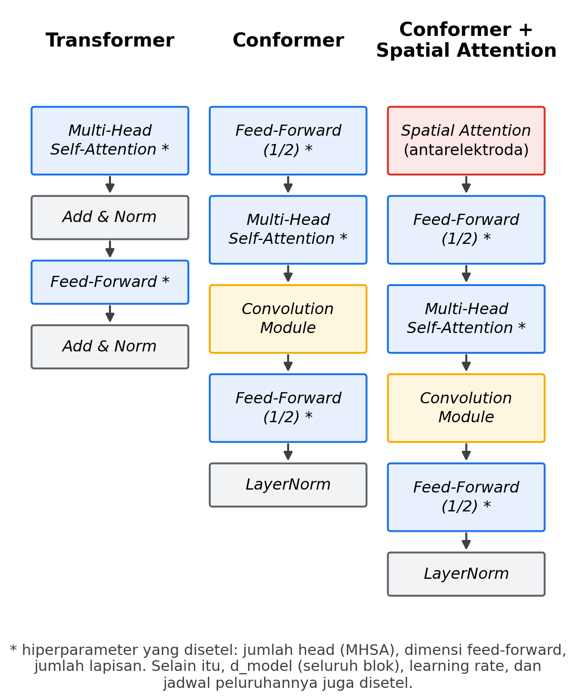
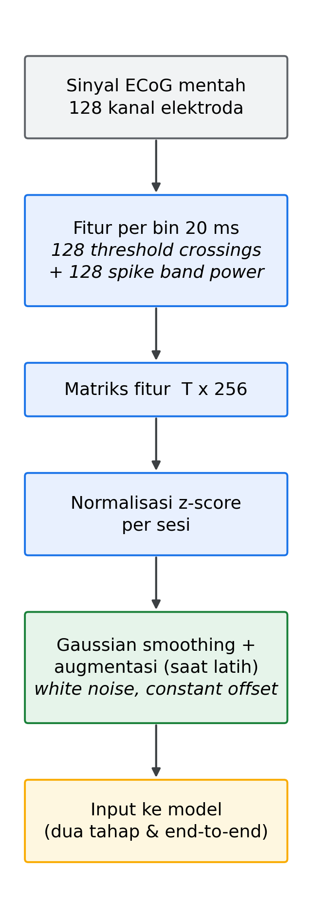
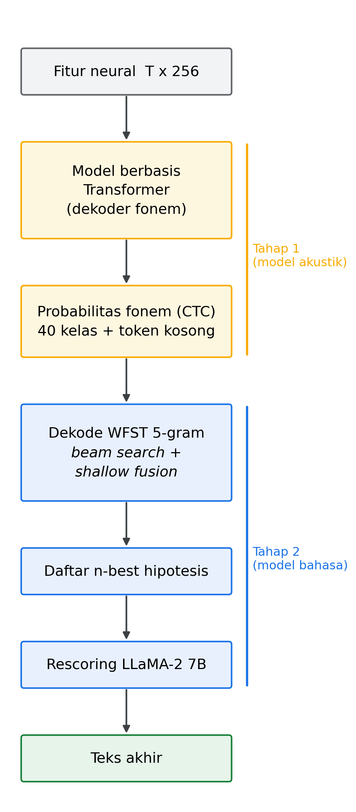
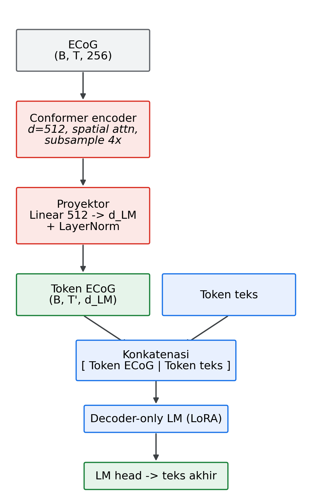
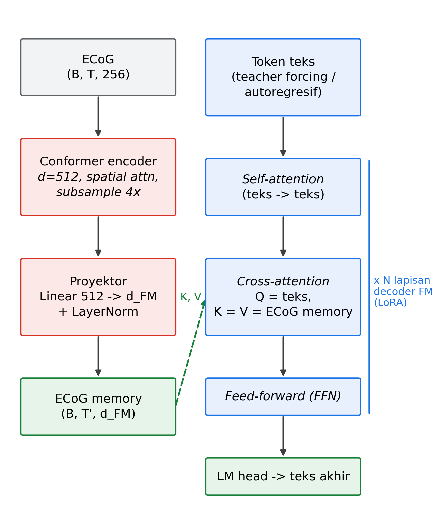

# BAB III ANALISIS MASALAH DAN RANCANGAN SOLUSI

Bab ini memaparkan analisis terhadap permasalahan yang muncul selama pengembangan sistem *neuroprosthesis* bicara pada tugas akhir ini beserta rancangan solusinya. Bagian III.1 menguraikan permasalahan yang dihadapi. Bagian III.2 memaparkan alternatif solusi untuk setiap permasalahan tersebut beserta pilihan yang diambil. Terakhir, bagian III.3 menjabarkan rancangan solusi secara detail untuk arsitektur dua tahap dan arsitektur *end-to-end* (E2E).

## III.1 Analisis Masalah

Tugas akhir ini bertujuan membangun dan membandingkan sistem *neuroprosthesis* bicara dengan arsitektur dua tahap dan arsitektur E2E berbasis *Foundation Model* (FM). Agar tujuan tersebut tercapai, terdapat beberapa permasalahan dan ketidakpastian yang perlu ditangani. Permasalahan tersebut diuraikan sebagai berikut.

1. **Pemilihan Varian Transformer.** Arsitektur berbasis Transformer dapat diimplementasikan dengan banyak cara dan tiap pilihan memengaruhi kemampuan model menangkap pola pada sinyal ECoG. Terdapat dua aspek pilihan utama. Aspek pertama adalah varian arsitektur. Model dapat berupa Transformer murni, Conformer (yang menambahkan modul konvolusi untuk menangkap pola lokal pada sinyal akustik) (Gulati et al., 2020), atau Conformer yang dilengkapi *spatial attention* untuk menangkap dependensi antarelektroda. Aspek kedua adalah hiperparameter, seperti ukuran model (dimensi *hidden*, jumlah lapisan, jumlah *head*, dan dimensi lapisan *feed-forward*), nilai *dropout*, serta ukuran *kernel* konvolusi. Kombinasi varian dan hiperparameter yang paling tepat untuk dekode fonem dari sinyal ECoG belum diketahui di awal dan harus ditemukan melalui eksperimen.
2. **Pemilihan Arsitektur Foundation Model.** Terdapat banyak FM dengan karakteristik berbeda. Dari sisi arsitektur, FM dapat berupa *decoder-only*, *encoder-only*, atau *encoder-decoder*. Dari sisi modalitas pelatihan, FM dapat dilatih pada teks, audio, atau keduanya. FM juga berbeda dalam ukuran parameter dan kemampuan pemrosesan linguistik. Permasalahan utamanya adalah menentukan FM yang tidak hanya akurat dalam mendekode kalimat, tetapi juga memproses sinyal dalam waktu yang wajar.
3. **Adaptasi Model terhadap Jenis Input Baru.** FM saat ini dapat memproses berbagai modalitas, seperti teks, audio, dan gambar. Akan tetapi, FM belum mendukung sinyal ECoG sebagai input. Oleh karena itu, terdapat dua keputusan yang perlu diambil. Keputusan pertama adalah cara mengubah sinyal ECoG menjadi bentuk yang dapat diterima FM. Keputusan kedua adalah cara melatih FM agar terbiasa memproses input ECoG secara efisien tanpa harus melatih ulang seluruh parameternya.
4. **Latensi Inferensi dan Beban Komputasi.** Idealnya, sistem *neuroprosthesis* bicara mampu bekerja secara *real-time* agar komunikasi terasa alami. Namun, FM memiliki ukuran yang besar sehingga menimbulkan beban komputasi yang tinggi, baik dari sisi latensi inferensi maupun kebutuhan memori dan penyimpanan. Oleh karena itu, dari sisi waktu inferensi dan kebutuhan penyimpanan, sistem yang dibangun pada tugas akhir ini perlu melampaui atau setidaknya kompetitif dengan sistem milik Willett et al. (2023).

## III.2 Analisis Solusi

Bagian ini memaparkan solusi untuk setiap permasalahan pada bagian III.1.

1. **Pemilihan Varian Transformer.** Solusi yang diambil adalah bereksperimen dengan tiga varian, yaitu Transformer murni, Conformer, dan Conformer dengan *spatial attention*. Transformer murni dipilih sebagai dasar karena mekanisme *self-attention*-nya mampu menangkap dependensi jangka panjang pada keseluruhan input secara langsung (Vaswani et al., 2017). Conformer dipilih karena menambahkan modul konvolusi yang menangkap pola lokal sehingga lebih sesuai untuk sinyal berderet waktu seperti ucapan (Gulati et al., 2020). Conformer dengan *spatial attention* dipilih karena menambahkan *attention* pada dimensi elektroda sehingga model dapat menangkap dependensi antarelektroda pada sinyal ECoG yang terdiri dari banyak kanal. Perbandingan susunan blok ketiga varian ditunjukkan pada Gambar III.1. Untuk setiap varian, pelatihan dimulai dengan hiperparameter asli dari paper masing-masing varian, kemudian dilakukan penyetelan hiperparameter (*hyperparameter tuning*) sepanjang penelitian. Hiperparameter yang disetel meliputi dimensi *hidden* model, jumlah lapisan, jumlah *attention head*, dimensi lapisan *feed-forward*, *learning rate*, serta jadwal *learning rate decay*.

   

   **Gambar III.1** Perbandingan susunan blok Transformer, Conformer, dan Conformer dengan *spatial attention*. Tanda * menandai komponen yang hiperparameternya disetel.
2. **Pemilihan Arsitektur Foundation Model.** Solusi yang diambil adalah bereksperimen dengan beragam FM yang berbeda dari sisi arsitektur, modalitas pelatihan, dan ukuran. Daftar FM yang digunakan beserta karakteristiknya ditunjukkan pada Tabel III.1.

   **Tabel III.1** Daftar *Foundation Model* yang digunakan beserta karakteristiknya.

   | Model                 | Penyedia | Modalitas Pelatihan | Mekanisme Adaptasi Modalitas             | Ukuran Parameter |
   | --------------------- | -------- | ------------------- | ---------------------------------------- | ---------------- |
   | Qwen3.5-0.8B-Base     | Alibaba  | Teks                | Proyeksi dan konkatenasi (gayaLLaVA) | ~0,8 miliar      |
   | Whisper-medium.en     | OpenAI   | Audio               | *Cross-attention*                      | ~769 juta        |
   | Whisper-large-v3      | OpenAI   | Audio               | *Cross-attention*                      | ~1,55 miliar     |
   | Cohere Transcribe     | Cohere   | Audio               | *Cross-attention*                      | ~2 miliar        |
   | Canary-Qwen-2.5B      | NVIDIA   | Audio dan teks      | Proyeksi dan konkatenasi (gayaLLaVA) | ~2,5 miliar      |
   | Granite-Speech-4.1-2B | IBM      | Audio dan teks      | Proyeksi dan konkatenasi (gayaLLaVA) | ~2 miliar        |

   Kelompok model ini sengaja dipilih untuk mencakup variasi yang luas. Variasi tersebut meliputi arsitektur (LLM teks *decoder-only* atau *encoder-decoder* audio), modalitas pelatihan (teks murni, audio, atau keduanya), ukuran (dari sekitar 769 juta hingga 2,5 miliar parameter), serta mekanisme adaptasi modalitas (konkatenasi gaya LLaVA atau *cross-attention*). Dengan keragaman ini, perbandingan dapat menjawab pendekatan mana yang paling cocok untuk sinyal ECoG. Whisper dan Cohere dimanfaatkan secara utuh sebagai model *encoder-decoder* audio melalui *cross-attention*, sedangkan Canary-Qwen dan Granite-Speech dimanfaatkan dengan menggunakan ulang model bahasa teks di dalamnya secara gaya LLaVA. Untuk Canary-Qwen, komponen yang digunakan ulang adalah model bahasa Qwen3-1.7B beserta proyektor dan *adapter* LoRA yang telah dilatih untuk penyelarasan ucapan. Untuk Granite-Speech, komponen yang digunakan hanyalah model bahasa teksnya, sedangkan *encoder* audio bawaannya tidak dipakai. Alasan lain pemilihan Canary-Qwen dan Granite-Speech adalah keduanya merupakan model bahasa yang telah terbukti menjadi fondasi sistem ASR berkinerja tinggi. Keberhasilan adaptasi tersebut menunjukkan keluarga model bahasa ini cocok untuk memetakan ucapan menjadi teks sehingga berpotensi untuk memetakan sinyal ECoG menjadi teks secara baik.
3. **Adaptasi Model terhadap Jenis Input Baru.** Untuk adaptasi modalitas, digunakan dua metode sesuai jenis FM. Untuk model bahasa teks *decoder-only* (Qwen, serta model bahasa dari Canary-Qwen dan Granite-Speech), digunakan proyeksi fitur yang diikuti konkatenasi token dengan gaya LLaVA (Liu et al., 2023). Untuk model audio *encoder-decoder* (Whisper dan Cohere), digunakan proyeksi fitur yang diikuti *cross-attention*. Pendekatan *cross-attention* dipilih untuk kasus ini agar sinyal ECoG hanya masuk melalui jalur *cross-attention* dan tidak melalui jalur *self-attention* teks. Hal ini menghindari permasalahan model belajar memprediksi teks dari teks sebelumnya tanpa benar-benar memanfaatkan sinyal ECoG. Untuk *fine-tuning*, dipilih LoRA karena mampu mengadaptasi model besar secara efektif dengan hanya melatih sebagian kecil parameter dan tanpa menambah latensi inferensi (Hu et al., 2021).
4. **Latensi Inferensi dan Beban Komputasi.** Pada tugas akhir ini, pertimbangan kecepatan dan beban komputasi dimasukkan ke dalam tahap pemilihan model, yaitu dengan memilih FM yang ukuran parameternya tidak terlalu besar agar latensi inferensi dan kebutuhan memori tetap wajar. Selanjutnya, latensi inferensi dan beban penyimpanan sistem yang dibangun diukur secara empiris melalui metrik RTF dan kata per menit, lalu dibandingkan dengan *baseline* Willett et al. (2023) pada lingkungan komputasi yang sama agar perbandingannya adil.

## III.3 Rancangan Solusi

Bagian ini menjabarkan rancangan solusi secara detail. Bagian III.3.1 menjelaskan praproses dan ekstraksi fitur yang sama untuk kedua arsitektur. Bagian III.3.2 menjelaskan rancangan arsitektur dua tahap, sedangkan bagian III.3.3 menjelaskan rancangan arsitektur E2E.

### III.3.1 Praproses dan Ekstraksi Fitur

Arsitektur dua tahap dan arsitektur E2E menerima input fitur neural yang diproses dengan cara yang sama sehingga praproses dan ekstraksi fiturnya dijelaskan satu kali pada bagian ini. Alur praproses ditunjukkan pada Gambar III.2.

**Gambar III.2** Alur praproses dan ekstraksi fitur dari sinyal ECoG mentah menjadi matriks fitur ternormalisasi.

Dataset Willett et al. (2023) terdiri atas 24 sesi perekaman dari satu partisipan (T12) yang dikumpulkan selama beberapa bulan. Untuk setiap rentang waktu (*bin*) selebar 20 milidetik, dataset menyediakan dua jenis fitur per kanal elektroda, yaitu *threshold crossings* dan *spike band power*. Fitur *threshold crossings* menghitung berapa kali sinyal melintasi suatu ambang batas, sedangkan *spike band power* merepresentasikan daya aktivitas *spiking* lokal (Willett et al., 2023). Fitur dari 128 kanal elektroda kemudian digabungkan sehingga setiap *bin* direpresentasikan oleh vektor berdimensi 256, yaitu 128 nilai *threshold crossings* dan 128 nilai *spike band power*. Seluruh *bin* dalam satu ujaran membentuk matriks fitur berukuran T x 256 dengan T sebagai jumlah *bin* waktu. Matriks tersebut kemudian dinormalisasi dengan *z-score* per sesi untuk mengatasi variasi statistik sinyal antarsesi perekaman. Pada tahap pelatihan, diterapkan pula *Gaussian smoothing* pada dimensi waktu serta augmentasi data berupa penambahan *white noise* dan *constant offset* untuk meningkatkan ketahanan model terhadap variasi sinyal.

### III.3.2 Rancangan Arsitektur Dua Tahap

Arsitektur dua tahap memetakan fitur neural menjadi teks melalui representasi fonem perantara. Alur lengkapnya ditunjukkan pada Gambar III.3. Tahap pertama adalah model akustik yang memetakan fitur neural menjadi probabilitas fonem. Tahap kedua adalah model bahasa yang mengubah probabilitas fonem menjadi teks koheren. Rancangan tiap komponen dijelaskan pada subbagian berikut.

**Gambar III.3** Alur arsitektur dua tahap dari fitur neural hingga teks akhir.

#### 1. Dekoder Fonem

Dekoder fonem bertugas memetakan matriks fitur neural menjadi matriks probabilitas fonem. Modul ini dapat diisi oleh salah satu varian model berbasis Transformer yang telah dijelaskan pada bagian III.2, yaitu Transformer murni, Conformer, atau Conformer dengan *spatial attention*. Apa pun varian yang dipilih, dekoder menerima matriks fitur berukuran T x 256 dan menghasilkan distribusi probabilitas fonem untuk setiap *bin* waktu. Keluaran dekoder berupa distribusi atas 40 kelas, yaitu 39 fonem dan satu token jeda, ditambah satu token kosong (*blank*) yang dibutuhkan oleh fungsi *loss* CTC.

Khusus untuk varian Conformer dengan *spatial attention*, modul *spatial attention* bekerja pada masukan mentah 256 kanal sebelum *subsampling* sehingga identitas tiap elektroda masih utuh. Modul ini meringkas tiap kanal elektroda menjadi satu nilai melalui rata-rata terhadap waktu, memproyeksikannya ke representasi berdimensi 64 yang ditambah *embedding* identitas tiap elektroda, lalu menjalankan *self-attention* antarelektroda dengan 4 *head*. Keluaran modul berupa gerbang bernilai 0 sampai 1 untuk tiap kanal yang menimbang ulang 256 kanal masukan. Dengan demikian, dimensi 64 adalah lebar representasi internal modul, sedangkan 4 *head* adalah jumlah kepala *attention* yang masing-masing menangkap pola hubungan antarelektroda yang berbeda. Mekanisme ini membuat model dapat menekankan elektroda yang paling informatif sebelum pemrosesan oleh blok Conformer.

#### 2. Pelatihan Model

Dekoder fonem dilatih dengan fungsi *loss connectionist temporal classification* (CTC) yang memungkinkan pelatihan pada pasangan sekuens yang belum diselaraskan (*unaligned*) (Graves et al., 2006). Pelatihan menggunakan optimizer Adam dengan *epsilon* sebesar 0,1 dan *gradient clipping* sebesar 10. Ukuran *batch* yang digunakan adalah 32. Laju pembelajaran (*learning rate*) mengikuti jadwal *cosine* dengan nilai awal 0,04 yang meluruh hingga 0,004 dan didahului 1000 langkah *warmup*. Untuk menghemat penggunaan memori, pelatihan dilakukan dengan presisi campuran (*mixed precision*). Pelatihan dijalankan hingga 150000 langkah dengan validasi setiap 500 langkah dan *early stopping* berdasarkan *phoneme error rate* (PER) validasi. *Early stopping* dipicu jika PER validasi tidak membaik melebihi 0,0001 selama 50 siklus validasi berturut-turut. Bobot model dengan PER validasi terendah disimpan sebagai hasil akhir.

#### 3. Model Bahasa

Setelah probabilitas fonem dihasilkan, tahap kedua mengubahnya menjadi teks melalui dua langkah. Langkah pertama adalah dekode dengan model bahasa 5-*gram* yang direpresentasikan dalam bentuk *weighted finite-state transducer* (WFST). Dekode dilakukan dengan algoritma *beam search* yang menggabungkan skor akustik dari probabilitas fonem dan skor linguistik dari model 5-*gram* melalui *shallow fusion* (Metzger et al., 2023). Langkah ini menghasilkan daftar *n-best*, yaitu sejumlah hipotesis kalimat yang paling memungkinkan. Langkah kedua adalah *rescoring* daftar *n-best* tersebut dengan model bahasa neural LLaMA-2 7B (Touvron et al., 2023). Skor akhir setiap hipotesis dihitung dari kombinasi berbobot antara skor akustik, skor model bahasa neural, dan bonus penyisipan kata. Bobot kombinasi dicari melalui *grid search*, yaitu mencoba berbagai kombinasi nilai untuk skala akustik (*acoustic scale*), bobot model bahasa, dan bonus penyisipan kata, lalu memilih kombinasi yang memberikan kesalahan terendah pada data validasi.

### III.3.3 Rancangan Arsitektur End-to-End

Arsitektur E2E memetakan sinyal ECoG langsung menjadi teks tanpa representasi fonem perantara. Rancangannya dijelaskan melalui dua subbagian, yaitu penyiapan arsitektur dan pelatihannya.

#### 1. Arsitektur End-to-End

Arsitektur E2E terdiri atas tiga komponen utama, yaitu *encoder*, proyektor, dan dekoder FM. Sinyal ECoG berukuran 256 kanal terlebih dahulu diproses oleh *encoder* Conformer yang berarsitektur sama dengan dekoder fonem pada arsitektur dua tahap, yaitu Conformer dengan *spatial attention* berdimensi 512 yang melakukan *subsampling* sekitar empat kali pada dimensi waktu. Keluaran *encoder* kemudian dipetakan oleh proyektor berupa lapisan *linear* yang diikuti *layer normalization*. Proyektor ini mengubah dimensi keluaran *encoder* dari 512 menjadi dimensi *hidden* FM, misalnya 1280 untuk Whisper-large-v3. Hasil proyeksi ini disebut *ECoG memory*.

Cara integrasi *ECoG memory* dengan dekoder FM bergantung pada jenis FM. Untuk FM teks *decoder-only* seperti Qwen, adaptasi dilakukan dengan gaya LLaVA seperti pada Gambar III.4. Token *ECoG memory* dikonkatenasi di depan token teks, lalu seluruh urutan gabungan diproses bersama oleh dekoder. Kekurangan pendekatan ini adalah token teks dapat mengakses token teks sebelumnya secara langsung melalui *self-attention* sehingga model berisiko memprediksi teks hanya dari teks sebelumnya tanpa benar-benar memanfaatkan sinyal ECoG. Risiko ini dikenal sebagai *text shortcut*.

**Gambar III.4** Alur arsitektur *end-to-end* gaya LLaVA untuk *Foundation Model* teks *decoder-only*.

Untuk FM audio *encoder-decoder* seperti Whisper dan Cohere, *ECoG memory* dimanfaatkan sebagai sumber *cross-attention* pada dekoder FM seperti pada Gambar III.5. Di dalam setiap lapisan dekoder, token teks pertama-tama melalui *self-attention* kausal yang hanya melihat token teks sebelumnya. Setelah itu, token teks mengakses *ECoG memory* melalui *cross-attention*. Pada mekanisme ini, token teks berperan sebagai *query* dan *ECoG memory* berperan sebagai *key* dan *value*. Rancangan ini memastikan sinyal ECoG tidak pernah berada di dalam jendela *self-attention* teks sehingga satu-satunya jalur dari sinyal ECoG menuju prediksi teks adalah *cross-attention*. Dengan demikian, pendekatan ini mengatasi *text shortcut* yang muncul pada pendekatan LLaVA. Pada kedua pendekatan, dekoder FM diadaptasi dengan LoRA agar dapat memproses input ECoG tanpa menambah latensi inferensi.

**Gambar III.5** Alur arsitektur *end-to-end* yang memanfaatkan *Foundation Model* audio melalui *cross-attention*.

#### 2. Pelatihan

*Encoder* Conformer terlebih dahulu dilatih secara tersendiri dengan CTC sebelum dipakai pada arsitektur E2E. Pada tahap ini, *encoder* dilengkapi satu lapisan keluaran linier yang memetakan representasi *encoder* menjadi probabilitas karakter, lalu dilatih dengan fungsi *loss* CTC (Graves et al., 2006) untuk memprediksi karakter teks langsung dari sinyal ECoG. Pelatihan menggunakan optimizer AdamW dengan laju pembelajaran 1 x 10⁻³ yang mengikuti jadwal *cosine* beserta *warmup*, *weight decay* sebesar 0,01, dan ukuran *batch* 16. Tahap ini menghasilkan *encoder* yang sudah mampu mengekstraksi representasi bermakna dari sinyal ECoG dan dipakai sebagai inisialisasi *encoder* pada arsitektur E2E.

Pelatihan arsitektur E2E menggunakan fungsi *loss cross-entropy* yang hanya dihitung pada posisi token teks, sedangkan posisi *prefix* diabaikan. Pelatihan dilakukan pada 24 sesi perekaman dengan 8800 data latih dan 880 data uji. *Encoder* diinisialisasi dari hasil pelatihan CTC tersebut sehingga tidak dilatih dari nol. Setelah inisialisasi tersebut, *encoder* dan proyektor tidak dibekukan, tetapi dilatih sepenuhnya bersama dekoder selama pelatihan E2E. Seluruh parameter *encoder* dan proyektor diperbarui, sedangkan dekoder FM hanya di-*finetune* melalui LoRA. Karena *encoder* sudah memiliki bobot terlatih dari tahap CTC, laju pembelajarannya dibuat jauh lebih kecil daripada proyektor agar bobot yang sudah baik tidak rusak. Adaptasi LoRA diterapkan pada modul *attention* (*query*, *key*, *value*, dan proyeksi keluaran), modul *cross-attention*, serta lapisan *feed-forward* decoder. Nilai *rank* yang digunakan adalah 16, *alpha* sebesar 32, dan *dropout* sebesar 0,1. Pelatihan dijalankan hingga 15000 langkah dengan ukuran *batch* efektif 16, 500 langkah *warmup*, dan presisi campuran. Laju pembelajaran mengikuti jadwal *cosine* dengan nilai puncak yang berbeda untuk tiap kelompok parameter, yaitu 6,9 x 10⁻⁵ untuk *encoder*, 1,0 x 10⁻³ untuk proyektor dan *cross-attention*, serta 1,75 x 10⁻⁴ untuk LoRA. Pada saat inferensi, teks dibangkitkan secara autoregresif.
