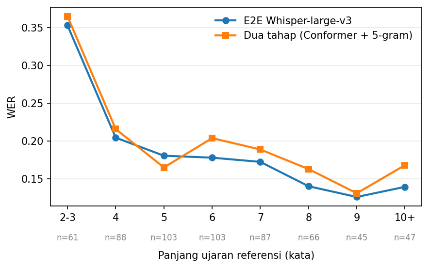

# BAB IV EVALUASI

Bab ini menjelaskan prosedur yang dijalankan untuk mengevaluasi solusi yang dirancang pada Bab III beserta hasil, analisis, dan pembahasannya. Bagian IV.1 memaparkan lingkungan pengembangan tempat seluruh eksperimen dijalankan. Bagian IV.2 menjabarkan desain eksperimen yang dilakukan. Bagian IV.3 memaparkan hasil setiap eksperimen. Bagian IV.4 memaparkan analisis lanjutan untuk memahami pola kesalahan dan keterbatasan arsitektur. Terakhir, bagian IV.5 membahas dan menafsirkan hasil eksperimen utama beserta analisis lanjutan tersebut.

## IV.1 Lingkungan Pengembangan

Seluruh proses pelatihan dan evaluasi model dijalankan pada GPU *cloud* yang disewa melalui layanan RunPod. GPU yang dipilih adalah NVIDIA GeForce RTX 4090. Pilihan ini didasari oleh ketersediaan, biaya sewa yang wajar, serta kapasitas memori 24 GB yang mencukupi untuk melatih *Foundation Model* berukuran besar dengan teknik LoRA. Spesifikasi lengkap lingkungan pengembangan ditunjukkan pada Tabel IV.1.

**Tabel IV.1** Spesifikasi lingkungan pengembangan.

| Komponen           | Spesifikasi                                                                         |
| ------------------ | ----------------------------------------------------------------------------------- |
| Prosesor           | 16 vCPU (host AMD EPYC)                                                             |
| RAM                | 62 GB                                                                               |
| GPU                | NVIDIA GeForce RTX 4090, 24 GB GDDR6X, arsitektur Ada Lovelace, 16.384*CUDA core* |
| Penyimpanan        | 200 GB                                                                              |
| Sistem Operasi     | Ubuntu 22.04 LTS                                                                    |
| Lingkungan virtual | Python*venv* berisi PyTorch (CUDA 12) dan TensorFlow 2.15                         |

Lingkungan virtual dibagi sesuai kebutuhan tiap jalur. Jalur *end-to-end* (E2E) dan *rescoring* model bahasa neural menggunakan PyTorch beserta pustaka transformers dan peft. Sementara itu, dekoder fonem dan dekode WFST pada arsitektur dua tahap menggunakan TensorFlow. Metrik kesalahan dihitung dengan pustaka jiwer.

## IV.2 Desain Eksperimen

Terdapat dua eksperimen yang dilakukan pada tugas akhir ini. Eksperimen pertama menguji kinerja dekoder fonem sebagai tahap pertama arsitektur dua tahap. Eksperimen kedua membandingkan kinerja arsitektur secara utuh, baik arsitektur dua tahap maupun arsitektur E2E, dari sisi akurasi dan efisiensi.

### IV.2.1 Eksperimen Dekode Fonem

Eksperimen ini bertujuan membandingkan kinerja empat dekoder fonem dalam memetakan fitur neural menjadi probabilitas fonem. Keempat dekoder tersebut adalah GRU sebagai *baseline*, Transformer murni, Conformer biasa, dan Conformer dengan *spatial attention*. GRU dipilih sebagai *baseline* karena merupakan dekoder yang digunakan oleh Willett et al. (2023). Transformer murni, Conformer murni, dan Conformer dengan *spatial attention* dipilih untuk menguji apakah arsitektur berbasis Transformer dapat melampaui *baseline* tersebut. Metrik yang digunakan adalah *phoneme error rate* (PER).

Setiap dekoder memiliki hiperparameter spesifik sebagai berikut.

1. **GRU.** Model terdiri atas 5 lapisan GRU searah dengan 1024 unit per lapisan dan berjumlah sekitar 53,6 juta parameter. Fitur masukan terlebih dahulu melewati lapisan input berdimensi 256 dengan fungsi aktivasi *softsign* dan *dropout* sebesar 0,4. Masukan juga ditumpuk pada dimensi waktu untuk melakukan *subsampling* dengan faktor empat sebelum diproses lapisan GRU.
2. **Transformer murni.** Model memiliki dimensi *hidden* 512, 4 lapisan, 8 *attention head*, dimensi lapisan *feed-forward* 2048, dan *dropout* sebesar 0,1. Informasi posisi dibubuhkan dengan *positional encoding* sinusoidal. Berbeda dengan dekoder lain, Transformer murni dilatih dengan *learning rate* yang lebih kecil, yaitu 0,015, untuk menjaga kestabilan pelatihan.
3. **Conformer vanila.** Model memiliki dimensi *hidden* 512, 4 lapisan, 8 *attention head*, dimensi lapisan *feed-forward* 2048, *kernel* konvolusi berukuran 31, dan *dropout* sebesar 0,1. Informasi posisi disandikan dengan *positional encoding* sinusoidal.
4. **Conformer dengan *spatial attention*.** Model memiliki konfigurasi yang sama dengan Conformer vanila, tetapi ditambah modul *spatial attention* pada dimensi elektroda dengan dimensi 64 dan 4 *head*.

Keempat dekoder dilatih dengan fungsi *loss* CTC, *optimizer* Adam, dan ukuran *batch* 32. Laju pembelajaran mengikuti jadwal *cosine* dengan *warmup* seperti yang dijelaskan pada Bab III. Pelatihan menggunakan *early stopping* berdasarkan PER validasi, dan bobot model dengan PER validasi terendah disimpan sebagai hasil akhir.

### IV.2.2 Eksperimen Evaluasi Arsitektur

Eksperimen ini bertujuan membandingkan kinerja arsitektur secara utuh dari sisi akurasi dan efisiensi. Akurasi diukur dengan *word error rate* (WER) dan *character error rate* (CER), sedangkan efisiensi diukur dengan ukuran penyimpanan, *real-time factor* (RTF), dan kata per menit (WPM). Arsitektur yang dibandingkan adalah arsitektur dua tahap dan arsitektur E2E dengan berbagai *Foundation Model* yang telah dijelaskan pada Bab III. Daftar arsitektur yang dievaluasi adalah sebagai berikut.

1. **Dua tahap (GRU + 5-*gram*).** Dekoder fonem GRU yang dilanjutkan dekode model bahasa 5-*gram* berbasis WFST.
2. **Dua tahap (Transformer + 5-*gram*).** Dekoder fonem Transformer murni yang dilanjutkan dekode model bahasa 5-*gram* berbasis WFST.
3. **Dua tahap (Conformer + 5-*gram*).** Dekoder fonem Conformer dengan *spatial attention* yang dilanjutkan dekode model bahasa 5-*gram* berbasis WFST.
4. **Dua tahap (GRU + 5-*gram* + LLaMA-2 7B).** Daftar *n-best* dari dekode WFST pada dekoder GRU di-*rescore* dengan model bahasa neural LLaMA-2 7B (Touvron et al., 2023).
5. **Dua tahap (Conformer + 5-*gram* + LLaMA-2 7B).** Daftar *n-best* dari dekode WFST pada dekoder Conformer dengan *spatial attention* di-*rescore* dengan model bahasa neural LLaMA-2 7B.
6. **E2E Qwen (gaya *LLaVA*).** Arsitektur E2E yang memanfaatkan model bahasa teks Qwen3.5-0.8B dengan adaptasi gaya *LLaVA*.
7. **E2E Whisper-medium.en (*cross-attention*).** Arsitektur E2E yang memanfaatkan model audio Whisper-medium.en melalui *cross-attention*.
8. **E2E Whisper-large-v3 (*cross-attention*).** Arsitektur E2E yang memanfaatkan model audio Whisper-large-v3 melalui *cross-attention*.
9. **E2E Cohere Transcribe (*cross-attention*).** Arsitektur E2E yang memanfaatkan model audio Cohere Transcribe melalui *cross-attention*.
10. **E2E Canary-Qwen (gaya *LLaVA*).** Arsitektur E2E yang menggunakan ulang model bahasa Qwen3-1.7B dari Canary-Qwen-2.5B dengan adaptasi gaya *LLaVA*.
11. **E2E Granite-Speech (gaya *LLaVA*).** Arsitektur E2E yang menggunakan ulang model bahasa dari Granite-Speech-4.1-2B dengan adaptasi gaya *LLaVA*.

WER dan CER dihitung pada tingkat korpus (*micro-average*), yaitu jumlah seluruh kesalahan dibagi jumlah seluruh kata atau karakter pada data uji. Sama seperti eksperimen dekode fonem, akurasi dilaporkan pada data uji dengan sesi perekaman yang sebanding dengan laporan Willett et al. (2023).

## IV.3 Hasil Eksperimen

### IV.3.1 Hasil Dekode Fonem

Hasil PER keempat dekoder fonem ditunjukkan pada Tabel IV.2. Conformer dengan *spatial attention* mencapai PER terendah, yaitu 0,1428. Conformer vanila menempati posisi kedua. GRU *baseline* berada di atas kedua varian Conformer tersebut, sedangkan Transformer murni memiliki PER tertinggi.

**Tabel IV.2** Hasil PER empat dekoder fonem.

| Dekoder Fonem                               | PER              |
| ------------------------------------------- | ---------------- |
| GRU 1024 unit 5 lapisan                     | 0,1597           |
| Transformer murni                           | 0,2444           |
| Conformer vanila                            | 0,1477           |
| **Conformer + *spatial attention*** | **0,1428** |

Hasil ini menunjukkan kedua varian Conformer mengungguli GRU *baseline*, sedangkan Transformer murni justru berada di bawah GRU. Hal ini menunjukkan mekanisme *self-attention* murni belum cukup untuk dekode fonem dari sinyal ECoG dan modul konvolusi pada Conformer berperan penting dalam menangkap pola lokal sinyal. Conformer dengan *spatial attention* juga mengungguli dekoder fonem GRU pada penelitian Seto (2025) yang memiliki PER sekitar 0,192. Dengan demikian, dekoder fonem berbasis Conformer terbukti lebih baik dalam memetakan fitur neural menjadi probabilitas fonem.

### IV.3.2 Hasil Evaluasi Arsitektur

Hasil akurasi setiap arsitektur ditunjukkan pada Tabel IV.3. Arsitektur dua tahap dengan *rescoring* LLaMA-2 7B mencapai WER terendah, yaitu 0,1556. Di antara arsitektur E2E, Whisper-large-v3 mencapai akurasi tertinggi dengan WER 0,1716.

**Tabel IV.3** Hasil WER dan CER setiap arsitektur.

| Arsitektur                                                | WER              | CER              |
| --------------------------------------------------------- | ---------------- | ---------------- |
| Dua tahap (GRU + 5-*gram*)                              | 0,1828           | 0,1327           |
| Dua tahap (Transformer + 5-*gram*)                      | 0,2927           | (menyusul)       |
| Dua tahap (Conformer + 5-*gram*)                        | 0,1858           | 0,1253           |
| Dua tahap (GRU + 5-*gram* + LLaMA-2 7B)                 | 0,1638           | 0,1194           |
| **Dua tahap (Conformer + 5-*gram* + LLaMA-2 7B)** | **0,1556** | **0,1127** |
| E2E Qwen (gaya*LLaVA*)                                  | 0,2537           | 0,2413           |
| E2E Whisper-medium.en                                     | 0,1760           | 0,1508           |
| **E2E Whisper-large-v3**                            | **0,1716** | **0,1428** |
| E2E Cohere Transcribe                                     | 0,1776           | 0,1523           |
| E2E Canary-Qwen                                           | (menyusul)       | (menyusul)       |
| E2E Granite-Speech                                        | (menyusul)       | (menyusul)       |

Hasil efisiensi setiap arsitektur ditunjukkan pada Tabel IV.4. Seluruh arsitektur, baik dua tahap maupun E2E, memiliki RTF jauh di bawah satu sehingga semuanya mampu bekerja lebih cepat daripada durasi ucapan aslinya. Dari sisi penyimpanan, arsitektur E2E jauh lebih ringan, yaitu 2,0 hingga 9,9 GB, dibandingkan arsitektur dua tahap yang mencapai 44,2 hingga 57,8 GB.

**Tabel IV.4** Jumlah parameter, ukuran penyimpanan, dan kecepatan setiap arsitektur.

| Arsitektur                                      | Total Parameter (komponen terbesar)     | Penyimpanan Total (komponen terbesar) | RTF        | WPM        |
| ----------------------------------------------- | --------------------------------------- | ------------------------------------- | ---------- | ---------- |
| Dua tahap (GRU + 5-*gram*)                    | 53,6 juta (GRU fonem 53,55 juta)        | 44,3 GB (TLG.fst 44,1 GB)             | 0,0155     | 4.556      |
| Dua tahap (Transformer + 5-*gram*)            | (menyusul)                              | (menyusul)                            | (menyusul) | (menyusul) |
| Dua tahap (Conformer + 5-*gram*)              | 28,5 juta (Conformer fonem 28,49 juta)  | 44,2 GB (TLG.fst 44,1 GB)             | 0,0069     | 10.307     |
| Dua tahap (GRU + 5-*gram* + LLaMA-2 7B)       | 6,79 miliar (LLaMA-2 6,74 miliar)       | 57,8 GB (TLG.fst 44,1 GB)             | 0,0756     | 935        |
| Dua tahap (Conformer + 5-*gram* + LLaMA-2 7B) | 6,77 miliar (LLaMA-2 6,74 miliar)       | 57,7 GB (TLG.fst 44,1 GB)             | 0,0430     | 1.650      |
| E2E Qwen (gaya*LLaVA*)                        | ~0,86 miliar (FM 0,8 miliar)            | 2,1 GB (FM 1,77 GB)                   | 0,0710     | 895        |
| E2E Whisper-medium.en                           | ~0,80 miliar (FM 769 juta)              | 2,0 GB (FM 1,54 GB)                   | 0,0455     | 1.394      |
| E2E Whisper-large-v3                            | ~1,57 miliar (FM 1,54 miliar)           | 3,6 GB (FM 3,09 GB)                   | 0,0742     | 857        |
| E2E Cohere Transcribe                           | ~2,0 miliar (FM ~2 miliar)              | 4,5 GB (FM 4,13 GB)                   | 0,0206     | 3.091      |
| E2E Canary-Qwen                                 | ~4,2 miliar (encoder Canary 2,5 miliar) | 9,9 GB (encoder Canary 5,12 GB)       | 0,1260     | 503        |
| E2E Granite-Speech                              | ~2,0 miliar (FM ~2 miliar)              | 5,3 GB (FM 4,87 GB)                   | 0,0672     | 943        |

Nilai RTF pada Tabel IV.4 adalah perbandingan waktu dekode terhadap durasi sinyal neural, sedangkan WPM adalah jumlah kata yang dihasilkan per menit waktu nyata (*wall-clock*) sebagai ukuran laju keluaran. RTF dan WPM tidak menghitung waktu muat model satu kali. Jumlah parameter sebagian *Foundation Model* bersifat perkiraan dari ukuran *snapshot* fp16, sedangkan ukuran penyimpanan dilaporkan sebagai bobot siap pakai. Pada model 5-*gram*, berkas TLG.fst tidak memiliki parameter terlatih (non-parametrik), tetapi tetap mendominasi penyimpanan sebesar 44,1 GB.

## IV.4 Analisis

Bagian ini memaparkan analisis lanjutan terhadap hasil eksperimen utama untuk memahami pola, kesalahan, dan keterbatasan kedua arsitektur.

### IV.4.1 Perbedaan Distribusi Probabilitas Fonem pada Dekoder 5-gram

Berdasarkan Tabel IV.2 dan Tabel IV.3, terdapat pola yang tidak intuitif pada hubungan antara PER dekoder fonem dan WER arsitektur dua tahap. Conformer dengan *spatial attention* memiliki PER sebesar 0,1428. Nilai PER ini lebih baik daripada GRU sebesar 0,1597. Akan tetapi, untuk variasi dekode 5-*gram* tanpa *rescoring*, dekoder GRU justru menghasilkan WER sebesar 0,1828 yang sedikit lebih rendah daripada Conformer (0,1858). Salah satu hipotesis untuk menjelaskan pola ini adalah ketajaman distribusi probabilitas fonem antarvarian dekoder yang berbeda mempengaruhi proses *beam search* WFST. Distribusi yang lebih tajam memangkas jalur secara lebih agresif sehingga berpotensi membuang jalur yang sebenarnya benar.

Untuk menguji hipotesis ini, dihitung entropi rata-rata distribusi probabilitas fonem per *frame* logit dari keluaran dekoder Conformer dengan *spatial attention* dan GRU. Hasilnya, Conformer memiliki entropi 0,0950 nats, sedangkan GRU memiliki entropi 0,1448 nats. Distribusi Conformer sekitar 34% lebih tajam daripada GRU.

Untuk mengonfirmasi mekanismenya secara lebih langsung, dihitung pula *coverage* dan WER *oracle* dari daftar *n-best* WFST 5-*gram* kedua dekoder pada pengaturan dekode yang sama dengan Tabel IV.3. *Coverage* adalah fraksi ujaran yang transkrip referensinya muncul persis di dalam daftar *n* hipotesis terbaik. WER *oracle* adalah WER terendah yang dapat dicapai jika selalu dipilih hipotesis terbaik dari daftar tersebut. Hasilnya ditunjukkan pada Tabel IV.5.

**Tabel IV.5** *Coverage*, *oracle WER*, dan ukuran rata-rata *n-best* dari *beam search* 5-*gram* untuk kedua dekoder pada data uji.

| Dekoder                          | Coverage | Oracle WER | Rata-rata ukuran*n-best* |
| -------------------------------- | -------- | ---------- | -------------------------- |
| Conformer +*spatial attention* | 58,0%    | 0,1018     | 32,6                       |
| GRU                              | 68,3%    | 0,0796     | 48,3                       |

Daftar *n-best* Conformer memiliki *coverage* yang lebih rendah, *oracle WER* yang lebih tinggi, dan rata-rata jumlah hipotesis yang lebih sedikit daripada GRU, meskipun batas maksimum *n-best*-nya sama. Temuan ini mengonfirmasi mekanisme yang dihipotesiskan secara langsung. *Beam* Conformer memang memangkas hipotesis lebih agresif sehingga jalur yang sebenarnya benar lebih sering hilang dari *beam* sebelum tahap *rescoring* dilakukan.

### IV.4.2 Pengaruh Panjang Ujaran terhadap WER

Ujaran uji dibagi ke dalam *bucket* berdasarkan panjang transkrip referensi dalam jumlah kata, lalu WER dihitung per *bucket* untuk kedua arsitektur. Hasilnya ditunjukkan pada Gambar IV.1.

**Gambar IV.1** WER setiap arsitektur untuk *bucket* panjang ujaran referensi pada data uji. Angka di bawah label menunjukkan jumlah ujaran per *bucket*.

WER kedua arsitektur cenderung menurun seiring panjang ujaran yang lebih panjang. Untuk ujaran terpendek (2-3 kata, n=61), dua tahap mencapai WER 0,3653 dan E2E mencapai WER 0,3533. WER kedua arsitektur kemudian menurun menjadi sekitar 0,14 untuk panjang 10 kata ke atas. E2E memiliki WER yang lebih rendah pada hampir seluruh panjang kata, kecuali pada panjang 5 kata yang dimenangkan dua tahap dengan WER 0,1750 dibandingkan E2E (WER 0,2006).

**

### IV.4.3 Perbandingan Kesalahan E2E dan Dua Tahap

Untuk melihat sejauh mana E2E dan dua tahap dapat saling melengkapi kesalahan, setiap ujaran uji diklasifikasikan berdasarkan apakah E2E Whisper-large-v3 dan dua tahap (Conformer + 5-*gram*) menghasilkan transkripsi yang benar (WER=0) atau salah. Hasilnya ditunjukkan pada Tabel IV.6.

**Tabel IV.6** Tabel kontingensi kebenaran E2E vs dua tahap pada data uji

|                     | Dua tahap benar | Dua tahap salah |
| ------------------- | --------------- | --------------- |
| **E2E benar** | 175 (29,2%)     | 71 (11,8%)      |
| **E2E salah** | 66 (11,0%)      | 288 (48,0%)     |

Sebanyak 22,8% ujaran benar pada satu arsitektur tetapi salah pada arsitektur yang lain. Untuk mengukur potensi maksimum gabungan kedua arsitektur, dihitung pula *best-of-two* WER, yaitu WER yang diperoleh jika untuk setiap ujaran dipilih arsitektur dengan WER lebih rendah. Hasilnya adalah WER sebesar 0,1249. Nilai ini jauh di bawah WER masing-masing arsitektur tunggal, yaitu 0,1716 untuk E2E Whisper-large-v3 dan 0,1858 untuk dua tahap (Conformer + 5-*gram*).

## IV.5 Pembahasan

Di antara seluruh arsitektur, E2E Whisper-large-v3 memberikan keseimbangan terbaik antara akurasi dan efisiensi. Dari sisi akurasi, model ini hanya kalah dari arsitektur dua tahap yang memakai *rescoring* LLaMA-2 7B. Apabila bantuan model bahasa neural tersebut ditiadakan, seluruh arsitektur dua tahap justru kalah dari Whisper-large-v3, baik GRU, Conformer, maupun Transformer. Dari sisi efisiensi, Whisper-large-v3 hanya membutuhkan 3,6 GB penyimpanan. Kebutuhan ini jauh lebih kecil daripada arsitektur dua tahap mana pun. Oleh karena itu, Whisper-large-v3 menjadi pilihan paling seimbang untuk penerapan nyata.

Arsitektur dua tahap dengan *rescoring* LLaMA-2 7B memang mencapai WER dan CER terendah secara keseluruhan. WER tersebut juga lebih baik daripada *baseline* Willett et al. (2023) yang sekitar 0,174 dan hasil Seto (2025) yang sekitar 0,169. Akan tetapi, keunggulan akurasi ini ditukar dengan beban penyimpanan dan komputasi yang besar. Penyimpanannya yang sebesar 57,7 GB didominasi berkas TLG *finite state automata* dan bobot LLaMA-2 7B. Penambahan *rescoring* juga memperlambat dekode beberapa kali lipat. Hal ini terlihat dari RTF dekode GRU yang naik dari 0,0155 menjadi 0,0756.

Lebih lanjut, analisis *coverage* dan WER *oracle* pada bagian IV.4.1 menunjukkan jalur dua tahap memiliki *bottleneck* yang membatasi kinerjanya. Pada lebih dari 40% ujaran uji, transkrip referensi tidak muncul di daftar *n-best* sehingga tidak ada *rescorer* yang dapat memperbaiki ujaran-ujaran tersebut. WER *oracle* yang hanya 0,1018 menjadi batas bawah yang dapat dicapai oleh *rescorer* sebaik apa pun pada *beam* tersebut. Arsitektur E2E tidak mengalami kendala *beam search* karena menghasilkan teks langsung tanpa representasi fonem perantara. Permasalahan *bottleneck* tersebut dapat menjadi argumen tambahan untuk pendekatan E2E di luar pertimbangan akurasi.

Dari sisi kecepatan, seluruh arsitektur sudah bekerja lebih cepat daripada waktu nyata, bahkan untuk arsitektur yang paling lambat sekalipun. Oleh karena itu, pertimbangan utama bukan kecepatan, melainkan penyimpanan dan akurasi. Pada aspek penyimpanan, arsitektur E2E unggul jauh dengan kebutuhan 2,0 hingga 9,9 GB dibandingkan 44,2 hingga 57,8 GB pada arsitektur dua tahap. Beban penyimpanan dua tahap hampir seluruhnya berasal dari berkas TLG.fst, sedangkan dekoder fonemnya sendiri hanya berukuran ratusan *megabyte*.

Di antara arsitektur E2E, model audio yang diadaptasi melalui *cross-attention* pada umumnya mengungguli model bahasa teks dengan mekanisme LLaVA. Whisper-large-v3, Whisper-medium.en, dan Cohere Transcribe seluruhnya memiliki WER yang jauh lebih rendah daripada Qwen yang memiliki pendekatan LLaVA.  Di antara model audio, model yang lebih besar memberikan akurasi yang lebih baik. Hal ini terlihat dari Whisper-large-v3 yang mengungguli Whisper-medium.en.  Cohere Transcribe menjadi varian tercepat meskipun jumlah parameternya paling besar. Hal ini terjadi karena latensi dekode dipengaruhi oleh kedalaman dekoder. Pada jalur *cross-attention*, *encoder* audio bawaan FM tidak dijalankan karena keluaran *encoder* ECoG menggantikannya sehingga hanya dekoder yang berjalan secara autoregresif. Dekoder Cohere hanya memiliki 8 lapisan, sedangkan dekoder Whisper-large-v3 memiliki 32 lapisan.

Pada eksperimen dekode fonem, penambahan *spatial attention* menurunkan PER dibandingkan Conformer biasa. Hasil ini menunjukkan modul *spatial attention* membantu model menangkap dependensi antarelektroda pada sinyal ECoG yang terdiri atas banyak kanal. Kedua varian Conformer juga mengungguli GRU, sedangkan Transformer murni memiliki PER tertinggi. Oleh karena itu, modul konvolusi pada Conformer berperan penting dan Transformer murni belum cukup untuk dekode fonem dari sinyal ECoG.

Ketajaman distribusi fonem yang terukur pada bagian IV.4.1 menjelaskan mengapa GRU sedikit unggul terhadap Conformer pada dekode 5-*gram* tanpa *rescoring* meskipun PER-nya lebih tinggi. Keunggulan WER GRU tersebut hilang setelah *rescoring* dengan LLaMA-2 7B. Conformer dengan *spatial attention* kembali unggul dengan WER 0,1556 dibandingkan 0,1638 milik GRU karena model bahasa neural mampu memilih hipotesis yang lebih baik dari daftar *n-best* sehingga memulihkan keunggulan akurasi fonem Conformer.

Pola panjang ujaran pada bagian IV.4.2 menunjukkan WER kedua arsitektur sama-sama menurun seiring panjang ujaran yang lebih panjang. E2E Whisper-large-v3 lebih unggul pada hampir semua *bucket* panjang. Dua tahap hanya unggul pada *bucket* ujaran dengan tepat 5 kata. Pola ini dapat dijelaskan oleh perbedaan jangkauan konteks kedua arsitektur. Model bahasa 5-*gram* memiliki jangkauan konteks tetap, yaitu empat kata sebelumnya, sehingga model ini bekerja paling optimal tepat pada ujaran 5 kata di mana seluruh kata pendahulu masih muat di dalam jendela konteksnya. Pada ujaran yang lebih panjang, jendela 5-*gram* tetap terbatas pada empat kata terakhir sehingga konteks tambahan yang dimiliki E2E menjadi keunggulan. Sebaliknya, dekoder *cross-attention* Whisper bersifat autoregresif tanpa jendela tetap sehingga setiap token yang dibangkitkan dapat memanfaatkan seluruh token yang sudah dibangkitkan sebelumnya.

Analisis tumpang tindih kesalahan pada bagian IV.4.3 menunjukkan 22,8% ujaran benar pada satu arsitektur tetapi salah pada arsitektur yang lain. Kedua arsitektur menangkap pola kesalahan yang berbeda. Jika untuk setiap ujaran selalu dipilih arsitektur dengan WER lebih rendah, WER gabungannya turun menjadi 0,1249. Nilai ini jauh di bawah WER tunggal masing-masing arsitektur dan menunjukkan potensi bagi *ensembling* untuk mengangkat akurasi melebihi tiap arsitektur tunggal sebagai arah pengembangan selanjutnya.

Arsitektur E2E pada tugas akhir ini cenderung mengalami *overfitting* karena jumlah data latih yang terbatas. Beberapa percobaan lanjutan dengan pelatihan yang lebih panjang maupun penambahan parameter tidak mampu menurunkan WER arsitektur E2E secara berarti. Hal ini menunjukkan kinerja arsitektur E2E lebih dibatasi oleh ketersediaan data daripada oleh kapasitas model. Penambahan data latih ECoG, baik melalui perekaman tambahan maupun melalui pralatih *encoder* pada data neural lintas-subjek, berpotensi meningkatkan kinerja arsitektur E2E dan dapat menjadi arah pengembangan selanjutnya.
